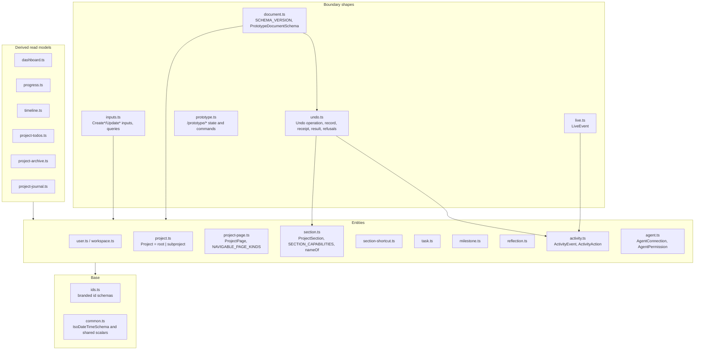
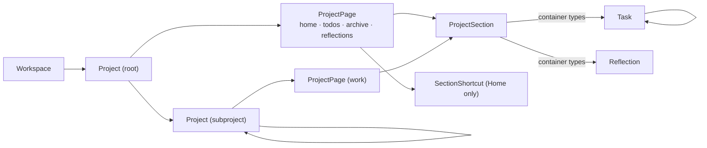

# What contracts are made of

## Structure

Every file is one topic; `index.ts` re-exports all of them, and that is the package's
only entrypoint. Entities are what the document stores; derived read models are what a
service computes for one page or tool (§54's combined reads); boundary shapes are what
crosses a transport.

## The ownership chain

`project → page → section → row` does not branch (§27): every section names a page,
every task and reflection names a section, and a subproject's single `work` page is a
record like any other so that no reader needs an "unless" clause. Shortcuts are
placements on a root's Home that reference a section elsewhere in the same tree.

## Inventory

| Part | Path | Role |
|---|---|---|
| `SCHEMA_VERSION`, `PrototypeDocumentSchema` | `src/document.ts` | The `data.json` shape and its version (`3`) |
| `ProjectSchema`, `isRootProject` | `src/project.ts` | Discriminated union on `kind`; status and `progressFormula` |
| `ProjectPageSchema`, `NAVIGABLE_PAGE_KINDS` | `src/project-page.ts` | Four root kinds plus `work`; which are tabs |
| `ProjectSectionSchema`, `SECTION_CAPABILITIES`, `SECTION_OWNERSHIP`, `ownedKindOf`, `nameOf` | `src/section.ts` | Sections, per-type capabilities, the container/view split, display names, grid presets |
| `SectionShortcutSchema` | `src/section-shortcut.ts` | Home placements referencing a source section |
| `TaskSchema` | `src/task.ts` | §33's task; `archivedAt`, `archivedWithSectionId`, `archivedWithTaskId` |
| `ReflectionSchema` | `src/reflection.ts` | Body, optional title/prompt, optional subject, archive markers |
| `ActivityEventSchema`, `ActivityActionSchema` | `src/activity.ts` | Actor-attributed events; open `entity.verb` action |
| `AgentConnectionSchema`, `AgentPermissionSchema` | `src/agent.ts` | Connections and the seven grants |
| `Create*Input`, `Update*Input`, `*Query` | `src/inputs.ts` | Write inputs and query shapes |
| `LiveEventSchema` | `src/live.ts` | `type`, `entityId`, `entityType`, `projectId`, `rootProjectId` |
| Dashboard, progress, timeline, todos, archive, journal schemas | `src/dashboard.ts` … `src/project-journal.ts` | Derived read models; Archive section entries add `recovery` metadata |
| Prototype state and commands | `src/prototype.ts` | What the dev panel and `/prototype/*` agree on |
| `UndoOperationSchema`, `SectionAddUndoOperationSchema`, `SectionMoveUndoOperationSchema`, `SectionUpdateUndoOperationSchema`, `SectionRemoveUndoOperationSchema`, `OperationReceiptSchema`, `SectionAddResultSchema`, `SectionWriteResultSchema`, `SectionRemovalResultSchema`, `UndoResultSchema`, `RedoResultSchema`, `UndoConflictSchema` | `src/undo.ts` | Versioned section add/move/update/removal payloads, field footprints, revision receipts, discriminated Undo and Redo results and typed conflicts |
| `OperationHistorySchema`, `OperationActionSchema`, `OperationHistorySummarySchema`, `OperationHistoryTransitionInputSchema`, `OperationHistoryStepInputSchema`, `OperationHistoryTransitionResultSchema`, `OperationHistoryRefusalDetailsSchema` | `src/operation-history.ts` | The per-actor, per-project cursor, its actions, the snapshot-free summary, strict transition inputs, results and the seven refusal reasons |
| Branded ids | `src/ids.ts` | `UserId`, `WorkspaceId`, `ProjectId`, `SectionId`, `TaskId`, `OperationHistoryId`, `OperationActionId`, … |
