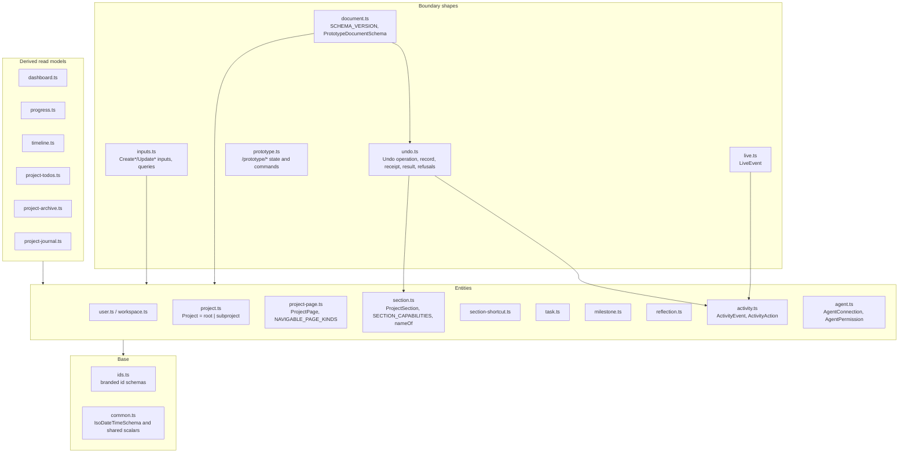
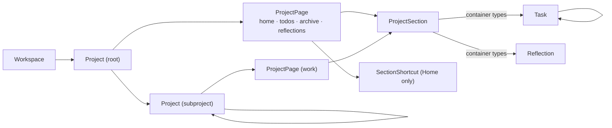

# What contracts are made of

## Structure

Every file is one topic; `index.ts` re-exports all of them, and that is the package's
only entrypoint. Entities are what the document stores; derived read models are what a
service computes for one page or tool (§54's combined reads); boundary shapes are what
crosses a transport.

## The ownership chain

`project → page → section → row` does not branch (§27): every section names a page,
every task and reflection names a section, and a subproject's single `work` page is a
record like any other so that no reader needs an "unless" clause. Shortcuts are
placements on a root's Home that reference a section elsewhere in the same tree.

## Inventory

| Part | Path | Role |
|---|---|---|
| `SCHEMA_VERSION`, `PrototypeDocumentSchema` | `src/document.ts` | The `data.json` shape and its version (`5`) |
| `ProjectSchema`, `isRootProject` | `src/project.ts` | Discriminated union on `kind`; status and `progressFormula` |
| `ProjectPageSchema`, `NAVIGABLE_PAGE_KINDS` | `src/project-page.ts` | Four root kinds plus `work`; which are tabs |
| `ProjectSectionSchema`, `SECTION_CAPABILITIES`, `SECTION_OWNERSHIP`, `ownedKindOf`, `nameOf` | `src/section.ts` | Sections, per-type capabilities, the container/view split, display names, grid presets |
| `SectionShortcutSchema` | `src/section-shortcut.ts` | Home placements referencing a source section |
| `TaskSchema` | `src/task.ts` | §33's task; `archivedAt`, `archivedWithSectionId`, `archivedWithTaskId` |
| `ReflectionSchema` | `src/reflection.ts` | Body, optional title/prompt, optional subject, archive markers |
| `ActivityEventSchema`, `ActivityActionSchema` | `src/activity.ts` | Actor-attributed events; open `entity.verb` action |
| `AgentConnectionSchema`, `AgentPermissionSchema` | `src/agent.ts` | Connections and the seven grants |
| `Create*Input`, `Update*Input`, `*Query` | `src/inputs.ts` | Write inputs and query shapes |
| `LiveEventSchema` | `src/live.ts` | `type`, `entityId`, `entityType`, `projectId`, `rootProjectId` |
| Dashboard, progress, timeline, todos, archive, journal schemas | `src/dashboard.ts` … `src/project-journal.ts` | Derived read models; Archive section entries add `recovery` metadata |
| Prototype state and commands | `src/prototype.ts` | What the dev panel and `/prototype/*` agree on |
| `UndoOperationSchema`, section operation schemas, `UndoResultSchema`, `RedoResultSchema`, `UndoConflictSchema` | `src/undo.ts` | The nineteen-operation union, section payloads, discriminated transition results and typed conflicts including the `page` entity kind |
| `SectionRestoreOperationSchema` and its directional results | `src/section-restore-history.ts` | The exact footprint of one Archive Restore: markers, generation, old position, committed placement and the rows it revived |
| Shortcut operation and transition schemas | `src/shortcut-history.ts` | Four strict placement payloads that capture the destination project and never the source's content |
| Task/reflection operation and transition schemas | `src/row-history.ts` | Strict row payloads: complete creation snapshots, changed fields, structural effects and optional implicit containers |
| `TaskAddResultSchema`, `TaskWriteResultSchema`, `ReflectionAddResultSchema`, `ReflectionWriteResultSchema` | `src/row-write-result.ts` | Lightweight `{ task|reflection, operation }` transport envelopes without executable payload imports |
| `SectionShortcutAddResultSchema`, `SectionShortcutWriteResultSchema`, `SectionShortcutRemovalResultSchema` | `src/shortcut-write-result.ts` | The placement write envelopes, with the removal naming ids and a required receipt |
| `PageAddOperationSchema`, `PageUpdateOperationSchema`, `OPTIONAL_PAGE_KINDS` and their directional results | `src/page-history.ts` | Two strict optional-page payloads confined to todos/archive/reflections, with an absent-page Undo Add result |
| `ProjectPageWriteResultSchema` | `src/page-write-result.ts` | The one `{ page, operation }` toggle envelope, with a `null` receipt for a no-op |
| `OperationReceiptSchema`, `OperationKindSchema`, `OperationFamilySchema` | `src/operation-receipt.ts` | Payload-free receipts and the operation kind/family vocabulary |
| Public history summary and input schemas | `src/operation-history-public.ts` | Snapshot-free cursor shapes imported by browser and transport consumers |
| `OperationHistorySchema`, `OperationActionSchema`, `OperationHistoryTransitionResultSchema`, `OperationHistoryRefusalDetailsSchema` | `src/operation-history.ts` | Stored per-actor/project cursor and actions, transition results and the refusal union |
| `ToolPermissionSchema`, `OPERATION_FAMILY_PERMISSION` | `src/tool-permissions.ts` | Static versus stored-family discovery declarations shared by registry and host |
| Branded ids | `src/ids.ts` | `UserId`, `WorkspaceId`, `ProjectId`, `SectionId`, `TaskId`, `OperationHistoryId`, `OperationActionId`, … |

Shared placement shapes live in `src/history-placement.ts`; `src/activity.ts` includes durable
historical identity on events and feed entries.
