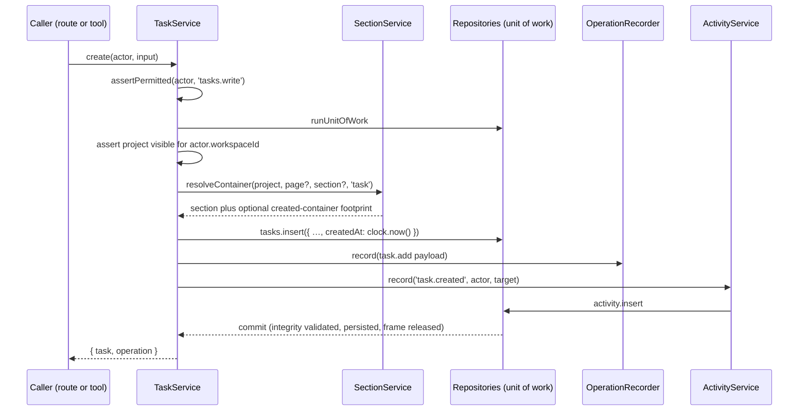

# What the domain is made of

## Structure

```mermaid
flowchart TB
  subgraph support["Support"]
    actor["actor.ts<br/>ActorContext, assertPermitted"]
    clock["clock.ts<br/>Clock, PrototypeClock, SimulatedClock"]
    ids["ids.ts<br/>IdGenerator, PrototypeIdGenerator"]
    errors["errors.ts<br/>DomainRuleError, EntityNotFoundError, PermissionDeniedError"]
    live["live-events.ts<br/>LivePublication, LiveEventPublisher"]
    vis["project-visibility.ts<br/>archivedAncestry"]
    inst["instants.ts / calendar.ts / task-windows.ts / page-placements.ts"]
  end
  subgraph writers["Writing services"]
    project[ProjectService]
    page[ProjectPageService]
    section[SectionService]
    shortcut[SectionShortcutService]
    task[TaskService]
    reflection[ReflectionService]
    agent[AgentConnectionService]
    history[OperationHistoryService]
    activity[ActivityService]
  end
  subgraph undoable["History seam"]
    recorder["operation-recorder.ts<br/>OperationRecorder, RepositoryOperationRecorder"]
    machine["operation-history.ts<br/>pure cursor state machine"]
    inverse["section-removal-undo.ts, section-edit-undo.ts, task-history.ts, reflection-history.ts, owned-rows.ts<br/>capture, revert and reapply functions"]
  end
  subgraph readers["Derived read services"]
    dashboard[DashboardService]
    progress[ProgressService]
    timeline[TimelineService]
    workspace[WorkspaceService]
    todos[ProjectTodosService]
    archive[ProjectArchiveService]
    journal[ProjectJournalService]
  end
  subgraph ai["AI seam"]
    aiport["ai-provider.ts<br/>AIProvider"]
    mock[PrototypeAIProvider]
  end
  task --> section
  reflection --> section
  project & page & section & shortcut & task & reflection & agent & history --> activity
  section & task & reflection --> recorder
  recorder --> machine
  history --> machine
  section -. captures through .-> inverse
  history -. executes through .-> inverse
  activity --> live
  dashboard --> aiport
  mock -. implements .-> aiport
  writers --> support
  readers --> support
```

Writing services own one entity each and record activity; the two arrows into
`SectionService` resolve which container a row lands in. Writing services also compose
`ActivityService` to record events; these service edges are acyclic. Section, task and reflection services record
each supported operation through the `OperationRecorder` interface, and
`OperationHistoryService` reverts or reapplies it through the same package-internal function
modules — neither composes the other, and `OperationHistoryService` composes no section, task or
reflection service. Derived read services
compose no other services: each reads
repositories directly, asserts every grant its result needs, and computes from canonical
records. `project-visibility.ts` is pure functions shared by both groups so that every
read agrees about what an archived ancestor hides.

## A write, and where the rules sit

## Inventory

| Part | Path | Role |
|---|---|---|
| `ActorContext`, `assertPermitted` | `src/actor.ts` | Who acts, in which workspace, with which grants |
| `Clock`, `PrototypeClock`, `SimulatedClock` | `src/clock.ts` | Frozen clock for tests; offset clock for the host (§45) |
| `IdGenerator`, `PrototypeIdGenerator` | `src/ids.ts` | Id minting, injectable for determinism |
| `DomainRuleError`, `EntityNotFoundError`, `PermissionDeniedError` | `src/errors.ts` | The three caller-caused failures; `DomainRuleError.details` carries a typed refusal |
| `LivePublication`, `LiveEventPublisher` | `src/live-events.ts` | A §62 frame addressed to a workspace, and the port that delivers it |
| `archivedAncestry` | `src/project-visibility.ts` | Archiving reaches down without cascading |
| `Instant` | `src/instants.ts` | Lossless ordering of ISO instants as text |
| `calendar.ts`, `task-windows.ts`, `page-placements.ts` | `src/` | UTC date arithmetic; the open/overdue/upcoming questions; the combined section+shortcut order |
| `ProjectService` | `src/project-service.ts` | Kinds, nesting, status, archive with children-first, reactivation guard |
| `ProjectPageService` | `src/project-page-service.ts` | A project's pages; enable/disable a root's optional three |
| `SectionService` | `src/section-service.ts` | Add, rename, move, resize, collapse, settle and remove by content/reference policy, Archive Restore; container resolution |
| `OperationRecorder`, `RepositoryOperationRecorder`, `OPERATION_ACTION_LIFETIME_MS` | `src/operation-recorder.ts` | Records into the exact actor's per-project history; 24-hour lifetime; recovers an outstanding removal receipt |
| Cursor state machine, `OPERATION_HISTORY_LIMIT` | `src/operation-history.ts` | Pure next-action selection, record, transition, retire and contiguous pruning; 50 actions per history |
| `OperationHistoryService` | `src/operation-history-service.ts` | Caller-scoped summary and one transition per call, with typed refusals and retirement |
| Execution seam | `src/operation-execution.ts` | `OperationExecutionRefused`, the permanent flag, `generationFloor` |
| Section capture, revert and reapply | `src/section-removal-undo.ts`, `src/section-edit-undo.ts`, `src/owned-rows.ts` | Package-internal section footprints, applied-state conflict collection and both directions |
| Task capture, revert and reapply | `src/task-history.ts` | Add/update/archive/restore footprints and preflighted row executors, including subtree and implicit-container effects |
| Reflection capture, revert and reapply | `src/reflection-history.ts` | Add/update/archive/restore footprints and preflighted row executors, including historical subjects and implicit containers |
| `snapshotPlacement`, `resolveRestoreIndex`, `findHighestWriteBlocker` | `src/page-placements.ts`, `src/project-visibility.ts` | Neighbour snapshot and restore index; the highest archived project blocking a write |
| `SectionShortcutService` | `src/section-shortcut-service.ts` | Home placements; identity and availability, never content |
| `TaskService` | `src/task-service.ts` | Create, update, complete, archive (cascading to subtasks), restore, move within a project |
| `ReflectionService` | `src/reflection-service.ts` | Write, edit, archive, restore; optional subject |
| `AgentConnectionService` | `src/agent-connection-service.ts` | Permissions and revocation — user actors only; throttled `lastUsedAt` |
| `ActivityService` | `src/activity-service.ts` | Captures durable target identity, records events and publishes one post-commit frame |
| `DashboardService` | `src/dashboard-service.ts` | §24's one derived read, including the digest and Fun Fact |
| `ProgressService`, `TimelineService` | `src/progress-service.ts`, `src/timeline-service.ts` | §39 formulas; §38 derived ranges |
| `WorkspaceService` | `src/workspace-service.ts` | `search_workspace`, `get_upcoming_work` under `workspace.read` |
| `ProjectTodosService`, `ProjectArchiveService`, `ProjectJournalService` | `src/project-*-service.ts` | The three root-wide projections (§34, §31, §36) |
| `sectionRecoveryOf` | `src/section-recovery-policy.ts` | Package-internal pure policy: which section entries Archive lists, with recovery metadata |
| `AIProvider`, `PrototypeAIProvider` | `src/ai-provider.ts`, `src/prototype-ai-provider.ts` | §42's interface; §43's deterministic implementation |
