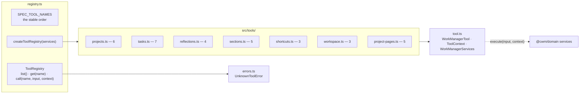
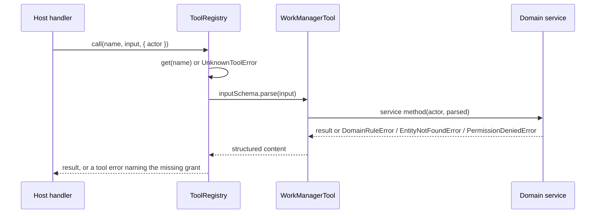

# What the tool registry is made of

## Structure

Each file in `src/tools/` exports the definitions for one entity group; the registry
concatenates them in `SPEC_TOOL_NAMES` order and exposes `list`, `get` and `call`.

## The thirty-three tools

| Group | Tools | Grant(s) |
|---|---|---|
| Projects | `list_projects`, `get_project`, `create_project`, `update_project`, `archive_project`, `restore_project` | `projects.read` / `projects.write` |
| Tasks | `list_tasks`, `get_task`, `create_task`, `update_task`, `complete_task`, `archive_task`, `restore_task` | `tasks.read` / `tasks.write` |
| Reflections | `list_reflections`, `add_reflection`, `archive_reflection`, `restore_reflection` | `reflections.read` / `reflections.write` |
| Sections | `list_sections`, `create_section`, `update_section`, `remove_section`, `restore_section` | `projects.read` / `projects.write` |
| Shortcuts | `list_section_shortcuts`, `add_section_shortcut`, `remove_section_shortcut` | `projects.read` / `projects.write` |
| Workspace | `search_workspace`, `get_upcoming_work`, `get_dashboard_context` | `workspace.read` |
| Pages | `list_project_pages`, `set_project_page_enabled`, `get_project_todos`, `get_project_archive`, `get_project_journal` | `projects.*`; the three derived pages add `tasks.read` and, for Archive and journal, `reflections.read` |

The registry's order is the order `tools/list` returns; §54 names the shortcut tools
without ordering them, so their position is the slice's choice.

## A call

## Inventory

| Part | Path | Role |
|---|---|---|
| `WorkManagerTool`, `ToolContext`, `WorkManagerServices` | `src/tool.ts` | The definition shape; what `execute` may reach |
| `SPEC_TOOL_NAMES`, `createToolRegistry`, `ToolRegistry` | `src/registry.ts` | The list, the factory, the runtime surface |
| `UnknownToolError` | `src/errors.ts` | A name not in the registry |
| Tool definitions | `src/tools/*.ts` | One file per group, as tabled above |
| `contract.test.ts` | `src/contract.test.ts` | One case per tool: success under minimal grants, denial per declared grant, store assertion |
| `registry.test.ts`, `activity.test.ts`, `errors.test.ts` | `src/` | Order and metadata; activity attribution; error mapping |
| Harness | `test/harness.ts` | Builds services over an `InMemoryDataStore` seeded from `agent-heavy`, counts persists, injects a foreign-workspace project |
