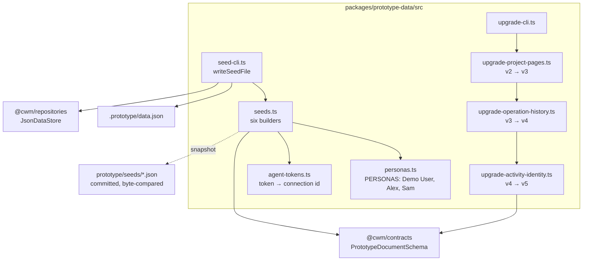

# What prototype data is made of

## Structure

## The seeds

| Seed | What it is for |
|---|---|
| `empty` | Every empty state; no agent connections, so no token authenticates |
| `personal-workspace` | The default after `pnpm prototype:reset`; a small realistic workspace |
| `busy-week` | Many tasks across dates: the dashboard, timeline and search |
| `nested-projects` | The integrated showcase since 25.8: a root with optional pages, three-level work units, Home shortcuts, archived ancestry, linked reflections, isolated agent connections |
| `overdue-chaos` | Overdue work; the simulated-date control's best demonstration |
| `agent-heavy` | Agent connections with the three fixture tokens; the MCP guides and contract harness seed |

## Inventory

| Part | Path | Role |
|---|---|---|
| `PERSONAS` | `src/personas.ts` | Three frozen `{ user, workspace }` pairs with stable ids and preferences |
| Agent tokens | `src/agent-tokens.ts` | `prototype-user-a-readwrite`, `-readonly`, `-revoked`; the host resolves them |
| Seed builders | `src/seeds.ts` | One function per seed over a fixed Monday-morning reference instant |
| `writeSeedFile` | `src/seed-cli.ts` | Atomic write of a seed over the data file; `INIT_CWD`-relative paths |
| `upgradeProjectPages`, `V3_SCHEMA_VERSION` | `src/upgrade-project-pages.ts` | The bounded v2 → v3 step, frozen at version 3 and returning opaque JSON |
| `upgradeOperationHistory` | `src/upgrade-operation-history.ts` | The v3 → v4 step: retires Undo receipts, adds history collections and generations; frozen opaque v4 output |
| `upgradeActivityIdentity` | `src/upgrade-activity-identity.ts` | The v4 → v5 step: validates legacy targets, captures Activity identity, preserves operation history and validates the final document |
| Upgrade CLI | `src/upgrade-cli.ts` | Sniffs the version, chains the steps, backs up as `.backup-<timestamp>.json`, writes through a temp file |
| v2 corpus | `test/fixtures/nested-projects-v2.json` | What the converter is tested against, kept because the seeds it would read were regenerated |
| v3 corpus | `test/fixtures/nested-projects-v3.json` | The `nested-projects` snapshot before `undoRecords` existed; the v3 → v4 converter's input, with legacy receipts added in memory by its tests |
| v4 corpus | `test/fixtures/history-v4.json` | Activity without captured context plus applied/undone version-4 history, proving the final step preserves it |
| Snapshots | `prototype/seeds/*.json` | The builders' output, committed for plain-Node scripts and byte comparison |
