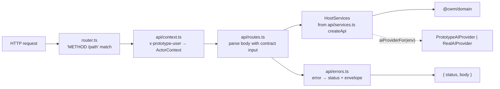

# What the API is made of

## Structure

## The route table

Read-only unless marked. Every write parses its body with the matching contract input.

| Family | Routes |
|---|---|
| Identity | `GET /api/me` |
| Projects | `GET /api/projects`, `POST /api/projects`, `GET /api/projects/:id`, `PATCH /api/projects/:id` |
| Derived per project | `GET /api/projects/:id/progress`, `/timeline`, `/todos`, `/archive`, `/journal`, `/completed-work` |
| Pages | `GET /api/projects/:projectId/pages`, `PATCH /api/projects/:projectId/pages/:kind` |
| Sections | `GET /api/projects/:projectId/sections`, `POST /api/projects/:projectId/sections`, `PATCH /api/sections/:id`, `DELETE /api/sections/:id`, `POST /api/sections/:id/move`, `/duplicate`, `/restore` |
| Shortcuts | `GET /api/projects/:projectId/shortcuts`, `GET /api/projects/:projectId/shortcut-sources`, `POST /api/projects/:projectId/shortcuts`, `PATCH /api/shortcuts/:id`, `DELETE /api/shortcuts/:id`, `POST /api/shortcuts/:id/move` |
| Tasks | `GET /api/tasks`, `POST /api/tasks`, `GET /api/tasks/:id`, `PATCH /api/tasks/:id`, `POST /api/tasks/:id/complete`, `/archive`, `/restore` |
| Reflections | `GET /api/reflections`, `POST /api/reflections`, `PATCH /api/reflections/:id`, `POST /api/reflections/:id/archive`, `/restore` |
| Dashboard and activity | `GET /api/dashboard`, `GET /api/activity` |
| Agent connections | `GET /api/agent-connections`, `PATCH /api/agent-connections/:id`, `POST /api/agent-connections/:id/revoke` |

`routes.test.ts` is the authoritative list; this table is a reading aid.

## Inventory

| Part | Path | Role |
|---|---|---|
| `createApi`, `HostServices`, `CreateApiOptions`, `aiProviderFor` | `api/services.ts` | Wire every service over a `Persistence`; select mock or real AI once |
| `createApiRoutes`, `ApiDependencies` | `api/routes.ts` | The table above |
| `resolveActor`, `LoadedContext` | `api/context.ts` | Persona header → actor; where the persona path and the token path meet |
| Error mapping | `api/errors.ts` | The one place a thrown thing becomes a status |
| `RealAIProvider` | `api/real-ai-provider.ts` | §44's stub, in the host because a real provider is network |
