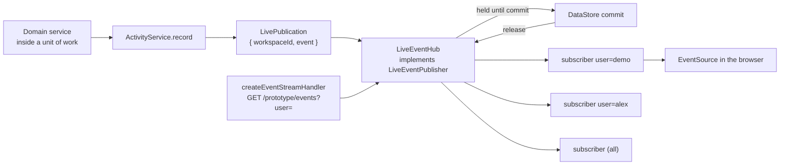
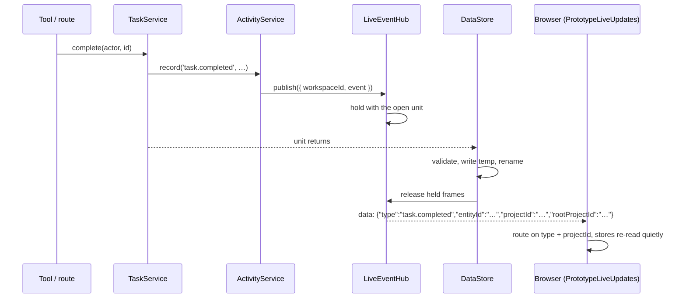

# What live updates are made of

## Structure

## One frame, from write to re-read

## Inventory

| Part | Path | Role |
|---|---|---|
| `LiveEventHub` | `events/hub.ts` | Subscriptions by persona (`undefined` = everything), holding and release, `prototype.reloaded` |
| `createEventStreamHandler`, `EventStreamOptions` | `events/sse.ts` | The raw route: headers, `retry` hint, framing, teardown on close |
| `LiveEventPublisher`, `LivePublication` | `packages/domain/src/live-events.ts` | The port and the addressed frame (domain side) |
| `LiveEventSchema` | `packages/contracts/src/live.ts` | The wire shape |
| In-process end-to-end | `live-updates.test.ts` (host root) | A committed write produces exactly one frame, after the write is readable |
| Acceptance | `scripts/live-acceptance.mjs` | Real MCP client → real stream, timed |
