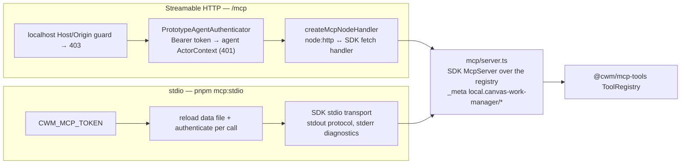

# What the MCP transport is made of

## Structure



Both transports build the same server from the same registry; they differ only in how a
request arrives and how the actor is resolved.

## A tool call over HTTP

```mermaid
sequenceDiagram
  participant C as MCP client
  participant H as /mcp raw route
  participant A as Authenticator
  participant S as SDK server
  participant R as ToolRegistry
  C->>H: POST /mcp (Authorization: Bearer …)
  H->>H: Host/Origin localhost? else 403
  H->>A: authenticate(token)
  A->>A: token → connectionId; read live connection; revoked/absent → 401
  A-->>H: agent ActorContext { permissions }
  H->>S: handle(request, actor)
  S->>R: call(name, input, { actor })
  R-->>S: result or tool error naming the missing grant
  S-->>C: JSON-RPC response
```

## Inventory

| Part | Path | Role |
|---|---|---|
| `createAuthenticatedMcpHandler`, `AuthenticatedMcpDependencies` | `mcp/handler.ts` | Guards + authenticator + SDK handler as one raw route |
| `createMcpNodeHandler` | `mcp/handler.ts` | The SDK's fetch-shaped handler adapted to `node:http` |
| SDK server factory | `mcp/server.ts` | Builds the `McpServer` over the registry; vendor `_meta` keys |
| Stdio entry | `mcp/stdio.ts` | `pnpm mcp:stdio`; reload-and-authenticate per call |
| `PrototypeAgentAuthenticator`, `AgentAuthenticationError`, `AgentAuthenticatorDependencies` | `auth/prototype-agent-authenticator.ts` | Token → live connection → actor; one 401 |
| Fixture tokens | `packages/prototype-data/src/agent-tokens.ts` | The table the authenticator reads |
| Acceptance | `scripts/mcp-acceptance.mjs` | Real client over both transports; `scripts/live-acceptance.mjs` for the HTTP + SSE path |
