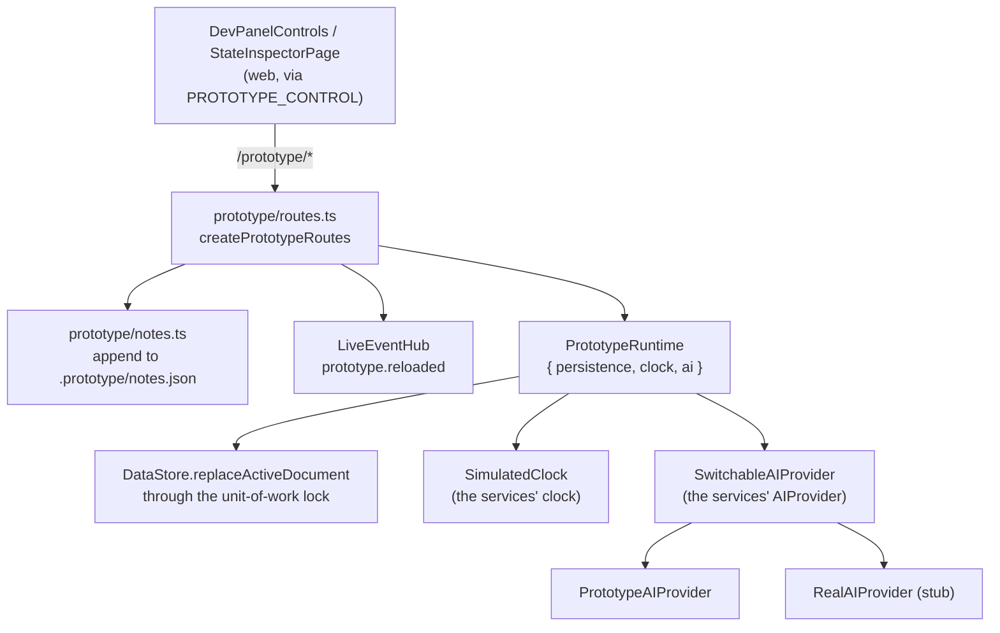

# What the prototype runtime is made of

## Structure

## The routes

| Route | Body | Effect |
|---|---|---|
| `GET /prototype/health` | — | `{"ok":true}` (in `router.ts`, the one route a bare host has) |
| `GET /prototype/state` | — | Seed, simulated clock, AI provider, personas, seed names, agent roster with tokens |
| `POST /prototype/seed` | `{"seed":"busy-week"}` | Swap the document; no restart; `prototype.reloaded` |
| `POST /prototype/reset` | — | Default seed **and** real time (§76) |
| `POST /prototype/clock` | `{"now":"2026-08-18T09:00:00.000Z"}` or `{"now":null}` | Simulated moment that keeps running; `null` returns to real time |
| `POST /prototype/ai-provider` | `{"provider":"mock"｜"real"}` | Swap the delegate inside `SwitchableAIProvider` |
| `POST /prototype/notes` | `{"note":"…","route":null,"projectId":null}` | Append a §79 note with real time and the current slice |

Shapes for all of these are `packages/contracts/src/prototype.ts`, shared with the panel.

## Inventory

| Part | Path | Role |
|---|---|---|
| `PrototypeRuntime`, `PrototypeRuntimeOptions` | `prototype/runtime.ts` | The changeable instances and the operations on them |
| `createPrototypeRoutes` | `prototype/routes.ts` | The table above (minus health) |
| Notes | `prototype/notes.ts` | Read file, push, write atomically; repo-anchored path; `AppendNoteOptions`, `NotesFileOperations` for tests |
| `SwitchableAIProvider` | `prototype/switchable-ai-provider.ts` | An `AIProvider` that delegates; the join between §44's env switch and §46's control |
| The clock | `packages/domain/src/clock.ts` — `SimulatedClock` | Real time plus an offset; `setNow` |
