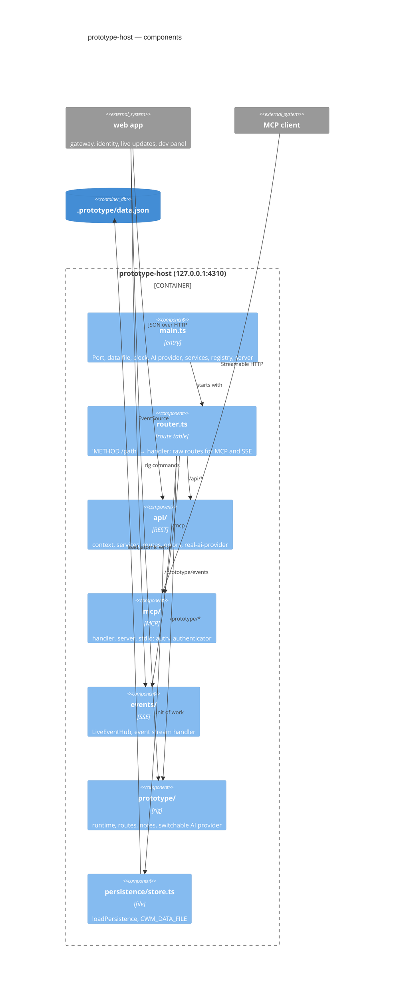
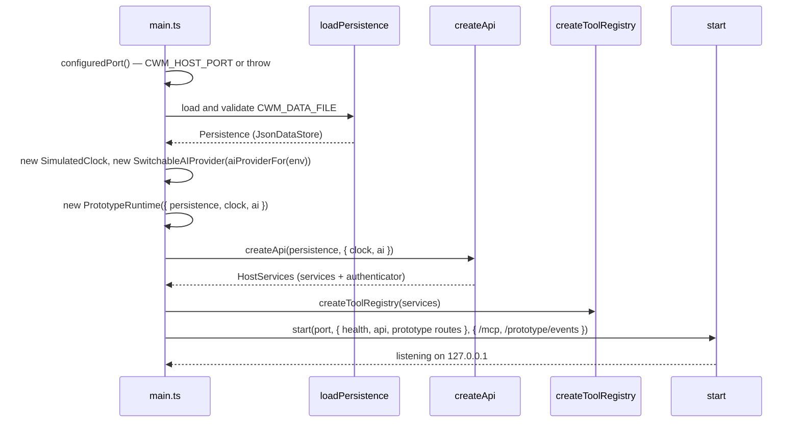

# What the host is made of

## Components

`main.ts` is the composition root; everything else is a module with one job and a test
beside it. The four `Rel`s from `router` are the three route families plus the stream.

## Startup

## Inventory

| Part | Path | Role |
|---|---|---|
| Entry | `main.ts` | `configuredPort`, `start`, `stop`, and the wiring above; runs only when invoked directly |
| Route table | `router.ts` | `RouteTable`, `RawRouteTable`, `createRequestHandler`, `healthRoutes`; CORS |
| REST | `api/` | [api](api/overview.md) |
| MCP | `mcp/`, `auth/` | [mcp-transport](mcp-transport/overview.md) |
| Events | `events/` | [live-updates](live-updates/overview.md) |
| Rig | `prototype/` | [prototype-runtime](prototype-runtime/overview.md) |
| Persistence | `persistence/store.ts` | `loadPersistence`, the repo-anchored default path, `CWM_DATA_FILE` |
| Acceptance scripts | `scripts/acceptance.mjs`, `agent-acceptance.mjs`, `mcp-acceptance.mjs`, `live-acceptance.mjs` | Slices 5, 13, 15 and 16's *done when*, run against a second host on a temp file |
| Cross-cutting tests | `main.test.ts`, `router.test.ts`, `concurrency.test.ts`, `live-updates.test.ts` | Start/stop, routing, concurrent units of work, end-to-end frame delivery in-process |
