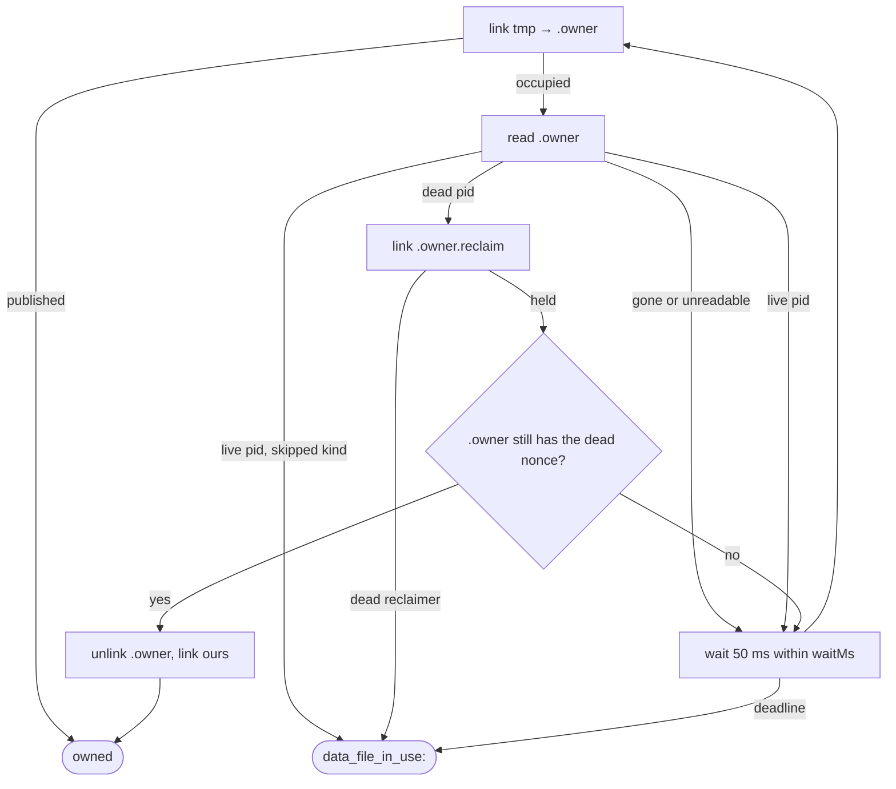

# How repositories work

## Runtime flow

Before any of this, the entrypoint that will write the file takes ownership of it with
`acquireDataFileOwnership` (see [One writer per data file](#one-writer-per-data-file) below). The
store itself never does.

1. The host calls `loadPersistence`, which opens the path from `CWM_DATA_FILE` (default
   `.prototype/data.json`, repo-anchored) with `JsonDataStore` and parses it through
   `validateDocumentIntegrity`. A missing file or a wrong `schemaVersion` fails the start.
2. A domain service asks the store for a unit of work. Units are queued: the next starts
   when the previous commits or discards, so provisional state is never visible to a
   concurrent operation.
3. Inside the unit, the `Json*Repository` instances read and write the provisional clone.
   Queries follow the shared semantics (AND, empty array matches nothing, archived
   excluded unless `includeArchived`).
4. On return the store validates the provisional document whole, writes it to a temp
   file, renames it over the data file, and releases any live frames the unit held.
5. On a throw the clone is discarded; a write attempted after the unit closed, or with a
   stale token, is rejected with `UnitOfWorkInProgressError` or a conflict.
6. `replaceActiveDocument` — used by the dev panel's seed swap and reset — runs *through*
   `runUnitOfWork`, so it cannot land under a queued unit.

## Key symbols

| Symbol | Kind | Role | Reference |
|---|---|---|---|
| `DataStore` | interface | `unitOfWorkFor` and document access | [API](../../api/interfaces/DataStore.html) |
| `UnitOfWork` | interface | The repositories a service uses inside one operation | [API](../../api/interfaces/UnitOfWork.html) |
| `BaseDataStore` | class | Queue, provisional state, commit, swap | [API](../../api/classes/BaseDataStore.html) |
| `JsonDataStore` | class | The file-backed store | [API](../../api/classes/JsonDataStore.html) |
| `InMemoryDataStore` | class | The test store | [API](../../api/classes/InMemoryDataStore.html) |
| `validateDocumentIntegrity` | function | The whole-document check at load and commit | [API](../../api/miscellaneous/variables.html#validateDocumentIntegrity) |
| `TaskRepository`, `ReflectionRepository`, `SectionRepository`, … | interfaces | One per collection; row/section removal is available only for domain-preflighted history execution | [API](../../api/interfaces/TaskRepository.html) |
| `OperationHistoryRepository` | interface | Per-actor, per-project Undo/Redo cursors; no `remove`, so a history's revision never restarts | [API](../../api/interfaces/OperationHistoryRepository.html) |
| `OperationActionRepository` | interface | History actions; the one collection that deletes routinely, because actions are pruned and redo branches discarded | [API](../../api/interfaces/OperationActionRepository.html) |
| `JsonCollectionRepository` | class | Shared helpers the twelve implementations extend | [API](../../api/classes/JsonCollectionRepository.html) |
| `UnitOfWorkInProgressError` | class | A write outside or after its unit | [API](../../api/classes/UnitOfWorkInProgressError.html) |
| `acquireDataFileOwnership` | function | Publish, wait for or reclaim a data file's owner record | [API](../../api/miscellaneous/variables.html#acquireDataFileOwnership) |
| `DataFileOwnership` | interface | The held record; `release()` and `releaseSync()` are nonce-checked and idempotent | [API](../../api/interfaces/DataFileOwnership.html) |
| `DataFileInUseError` | class | `data_file_in_use:` — a live owner, an unreadable record or a dead reclaimer's file is in the way | [API](../../api/classes/DataFileInUseError.html) |
| `DataFileOwnerUnavailableError` | class | `data_file_owner_unavailable:` — `link` failed with no owner to name | [API](../../api/classes/DataFileOwnerUnavailableError.html) |

## Dependencies

**Depends on**

- [contracts](../contracts/overview.md) — the document schema and every entity and query
  shape. Node's `fs/promises` for the JSON store.

**Depended on by**

- [domain](../domain/overview.md) — interfaces only, lint-enforced.
- [prototype-data](../prototype-data/overview.md) — the seed CLI writes through the
  store so a seed file is produced the same way a commit is.
- [prototype-host](../prototype-host/overview.md) — constructs the `JsonDataStore` and
  hands it to `createApi`.
- Tests in `packages/mcp-tools` and `apps/prototype-host` — `InMemoryDataStore`.

## One writer per data file

`acquireDataFileOwnership(dataPath, { kind, waitMs, onWait, skipWaitForKinds })` in
`data-file-ownership.ts` ([decision](../../decisions/2026-09-one-writer-per-data-file.md)):

1. Create the directory, then name the owner file `<realpath(dir)>/<basename>.owner`, so two
   spellings of one directory share it and different paths never do. A symlinked or hard-linked
   data file is not unified with its target.
2. Write `{ pid, nonce, kind, acquiredAt, dataPath }` whole to `<owner>.<nonce>.tmp` and publish it
   with `link`. `EEXIST`, `EPERM` and `EBUSY` mean *occupied* — the latter two are how Windows
   reports a file pending deletion. Any other code throws `data_file_owner_unavailable:` at once.
3. Occupied: read the record. If it has vanished — its owner let go at that instant — retry once
   at once, so a zero-wait command is not refused for a race it lost by microseconds. A dead pid is reclaimed (liveness is checked first, whatever the
   kind). A live owner of a kind in `skipWaitForKinds` is refused at once. Otherwise `onWait` fires
   once and the acquirer polls every 50 ms. Every retry, of any cause, counts against the one
   `waitMs` deadline.
4. Reclaim: publish `<owner>.reclaim` the same way; holding it, re-read the owner file and unlink it
   only if it still holds the dead record's nonce, then publish. Any mismatch starts over. The
   reclaim file is dropped in `finally`.



## Invariants and lints

- **Persist once per operation, never per property write** — structurally, because the
  only write path is the unit's commit.
- **The document is valid at every commit**, by the same function that validates it at
  load. The invariants it holds are listed in [why](why.md).
- **Section deletion is limited to safe disposable removals and safe explicit-add Undo.**
  `SectionService` uses `SectionRepository.remove` only after recovery policy and
  canonical-reference checks pass; `revertSectionAdd` uses it only when the added section is live,
  unchanged and still has no rows, cascade markers or shortcuts; `reapplySectionRemoval` only when
  Redo replays a removal that deleted the section. Shortcut placements, pruned or discarded
  history actions are the other deletions. The integrity checks still reject dangling row and
  shortcut references.
- **Project deletion is limited to creation Undo.** `ProjectRepository.remove` is used only by
  `revertProjectAdd`, after preflight proves the captured project and canonical page are unchanged
  and no page, section, row, child, reflection subject, shortcut or other actor's history refers to
  the project. It removes the page and project in one unit of work; no API exposes repository removal.
- **Optional-page deletion is limited to the inverse of a first enable.** `ProjectPageRepository`
  gained a `remove` in Slice 38 for exactly one caller: `revertPageAdd`, which uses it only when the
  record is still the one that enable created and no canonical section — archived ones included — and
  no shortcut placement names the page. Ordinary disabling writes one boolean through `update` and
  never reaches it, and no route or tool exposes it. The integrity checks are unchanged: a canonical
  `home` or `work` page is still required, and a section or placement whose page has gone still fails
  the commit, so a removal that left one rolls its whole unit back.
- **Operation histories are checked for scope and ordering**: unique ids; a history names a
  workspace, a stored project in it — or, after creation Undo, retains the matching undone
  `project.add` and the exact creator actor named by `project.created` — and an actor in it, and there is at most one per (workspace,
  project, exact actor); an action names a stored history, its operation's project is that
  history's, and its positive `order` is unique within the history and no higher than the
  history's `orderHighWaterMark` (the cursor's own bound is the contract's). The payload's section,
  page, shortcut and row ids are deliberately not resolved, so an action may outlive what it names —
  add Undo and disposable removal depend on that. The one live comparison is the
  `archiveGeneration` an action captured — a retained removal's, or a Restore's — which may not
  exceed its section's, because `archiveGeneration` never decreases. A missing section, row or page
  subject is still permitted for redo; a missing project history has the stricter creation anchor.
- **Nothing is ever taken from a live owner.** Only the holder of a nonce, or a reclaimer holding
  `<owner>.reclaim` that re-read the dead record's nonce, unlinks an owner file. An unreadable
  record, an alive but unrelated pid and a reclaim file left by a dead pid are refused, and the
  refusal names the file an operator may delete. There is no `--force`.
- **Seeds are committed byte-for-byte** as LF JSON and compared in
  `packages/prototype-data`'s tests, which is why `.gitattributes` normalises line
  endings.

## Commands

```bash
pnpm --filter @cwm/repositories test   # vitest: store, unit of work, integrity, query semantics
pnpm --filter @cwm/repositories lint   # tsc --noEmit
```

## Changing it

- **A new collection:** the interface in `interfaces.ts`, its `Json*Repository`, a slot in
  the document schema in contracts, and the integrity checks for any reference it holds.
  Then the `UnitOfWork` shape and every test-support builder that constructs one.
- **A new integrity rule:** a failing `data-store.test.ts` case with a document that
  violates it, then the check. Prefer this over a write-path guard when the rule is about
  the document rather than about one operation.
- **A new writer of a canonical file** (a CLI, a script) acquires around its write with a new
  `DataFileOwnerKind` and its remedy. Do not acquire inside a library function a host already
  calls under its own ownership: the host's own record would refuse it.
- **The trap:** writing a query filter that treats `[]` as "everything". The semantics
  entry exists because a gateway once did exactly that.

- **Row creation Undo and historical Activity:** safe row-add Undo uses task/reflection removal
  after the domain checks the full canonical reference set, including archived dependents. An
  implicit container is removed atomically with its row or the whole transition refuses. Activity
  is historical evidence, not a canonical reference that blocks removal.
- **The Activity exceptions are exact:** removed task/reflection targets require complete matching
  captured identity and canonical, workspace-scoped owning project/root. An absent project may be
  named by Activity only when its workspace contains `project.created` and the last creation
  lifecycle event in document order is `project.creation_undone`; every lifecycle event has the
  same exact actor as `project.created`. This anchor is separate from the matching undone
  `project.add` required for an absent project's history, whose history must belong to that actor.
