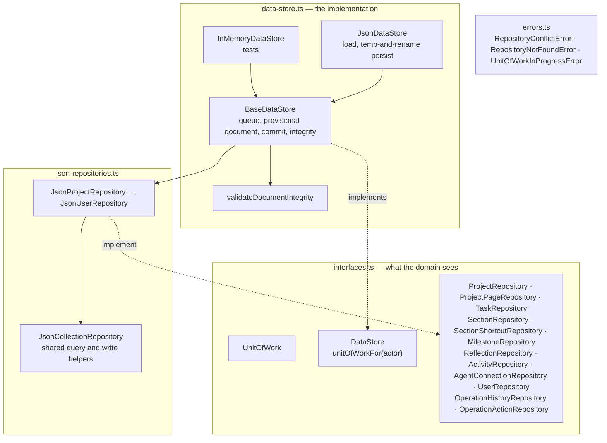
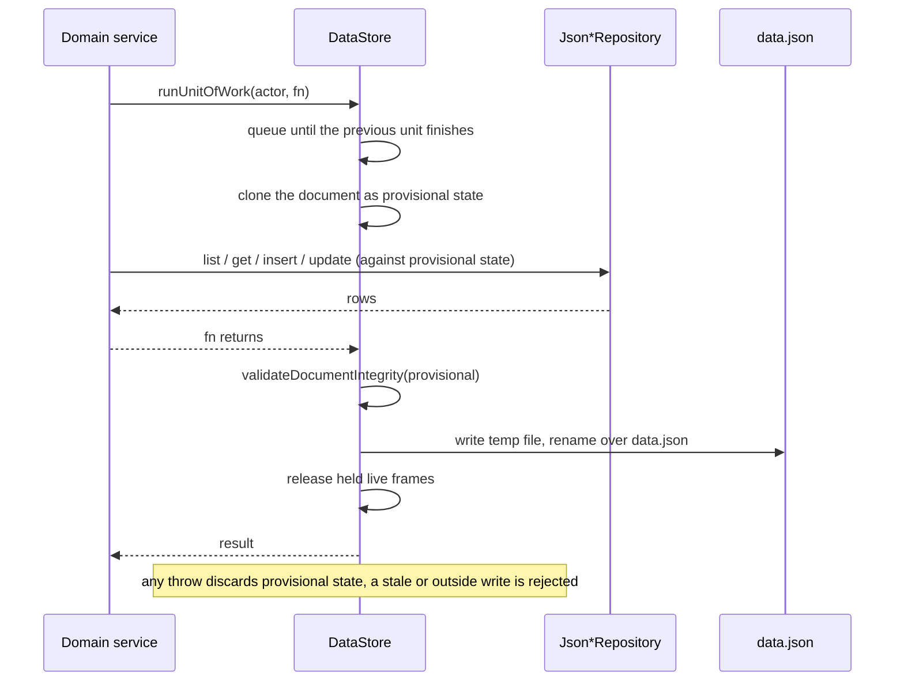

# What repositories are made of

## Structure

The domain imports only the left box. The right boxes are what the host constructs,
and what tests construct with `InMemoryDataStore` instead of `JsonDataStore`.

## A unit of work

## Inventory

| Part | Path | Role |
|---|---|---|
| `UnitOfWork`, `DataStore` | `src/interfaces.ts` | §15's operation boundary and the store that provides it |
| `*Repository` interfaces | `src/interfaces.ts` | One per collection; queries are contract shapes from `@cwm/contracts`; task, reflection, section, shortcut, page and action repositories expose bounded removal seams |
| `BaseDataStore` | `src/data-store.ts` | The queue, provisional state, commit and `replaceActiveDocument` |
| `InMemoryDataStore` | `src/data-store.ts` | Seeded from a literal; no disk |
| `JsonDataStore` | `src/data-store.ts` | Loads a path, persists with temp-and-rename |
| `validateDocumentIntegrity` | `src/data-store.ts` | Whole-document parse plus reference, uniqueness, scope and ownership checks |
| `JsonCollectionRepository`, `Json*Repository` | `src/json-repositories.ts` | The twelve implementations over provisional state, including the row and optional-page removals used by safe Add Undo and the two operation-history repositories |
| `RepositoryConflictError`, `RepositoryNotFoundError`, `UnitOfWorkInProgressError` | `src/errors.ts`, `src/data-store.ts` | Storage-level failures the domain maps or lets through as bugs |
