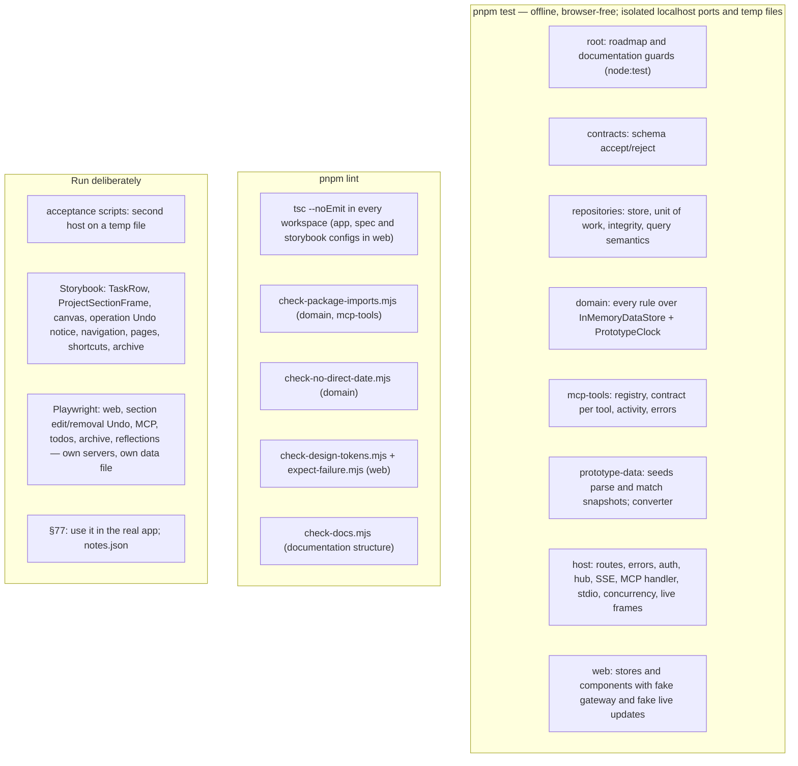
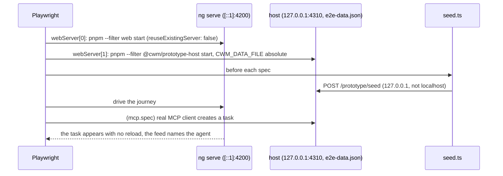

# What the testing system is made of

## The layers

## The e2e suite

## Inventory

| Part | Path | Role |
|---|---|---|
| Package suites | `packages/*/src/*.test.ts`, `apps/prototype-host/**/*.test.ts` | vitest, in-process |
| Root tooling suite | `scripts/roadmap.test.mjs`, `scripts/check-docs.test.mjs` | node:test, roadmap Outcome and built Compodoc anchor validation |
| Test support | `packages/domain/test/test-support.ts`, `packages/mcp-tools/test/harness.ts` | Store, clock, actor builders; persist counting; foreign-workspace injection |
| Web specs and stories | `apps/web/src/**/*.spec.ts`, `*.stories.ts` | `ng test` (vitest under `@angular/build:unit-test`); Storybook |
| Fakes | `apps/web/src/app/core/gateway/testing/`, `core/live/testing/`, `prototype/control/testing/` | What every web spec injects |
| Import lint | `scripts/check-package-imports.mjs` | AST allowlist; `--allow`, `--label`, `--root` |
| Date lint | `packages/domain/scripts/check-no-direct-date.mjs` | §45; `time-lint.test.ts` proves it |
| Token lint | `apps/web/scripts/check-design-tokens.mjs`, `expect-failure.mjs` | §21; the self-test pins each fixture |
| Docs check | `scripts/check-docs.mjs`, `scripts/roadmap.mjs check` | The documentation protocol's rules |
| Acceptance | `apps/prototype-host/scripts/{acceptance,agent-acceptance,mcp-acceptance,live-acceptance}.mjs` | Slices 5, 13, 15, 16; `mcp-acceptance` also carries Slice 33's recovery, foreign-actor, grant-removal and revocation checks on both transports |
| Recovery acceptance (host) | `apps/prototype-host/recovery-undo-acceptance.test.ts`, `live-updates.test.ts` | Real v2–v5 conversion/reopen and section chains over temp files; `live-updates.test.ts` adds commit-before-publish and the compound row Add fault matrix. Part of `pnpm test` |
| Row history chains | `packages/domain/src/row-history.test.ts`, `packages/prototype-data/src/upgrade-activity-identity.test.ts` | Task and reflection Undo/Redo chains, grants, compound containers and later-dependent refusals; the v4 → v5 Activity identity backfill |
| E2E | `apps/e2e/playwright.config.ts`, `prepare-data.mjs`, `seed.ts`, `web.spec.ts`, `canvas-editing.spec.ts`, `section-edit-undo.spec.ts`, `removal-undo.spec.ts`, `row-history.spec.ts`, `mcp.spec.ts`, `todos.spec.ts`, `archive.spec.ts`, `reflections.spec.ts` | §69's journeys; `pree2e` refreshes the scratch document, and Slice 36 adds browser commit boundaries, shared row history, live projections and compound implicit-container Undo/Redo |
| Milestone walkthrough | `docs/guides/first-milestone-walkthrough.md` | The manual click-path for every §81 bullet |
