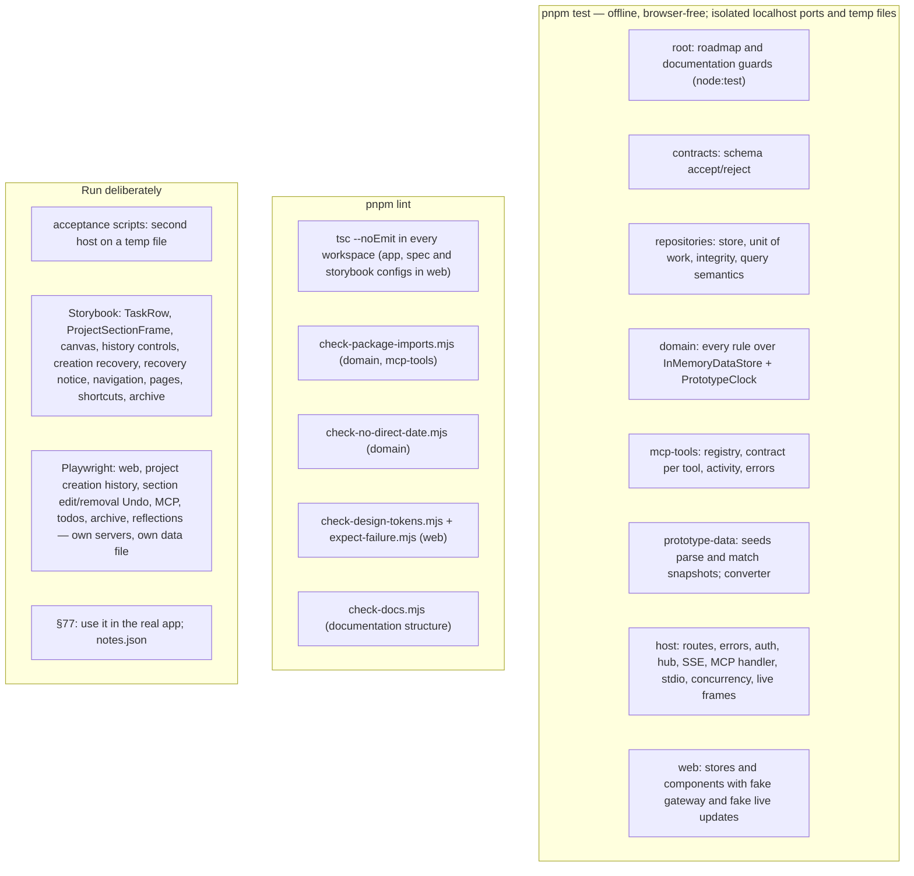
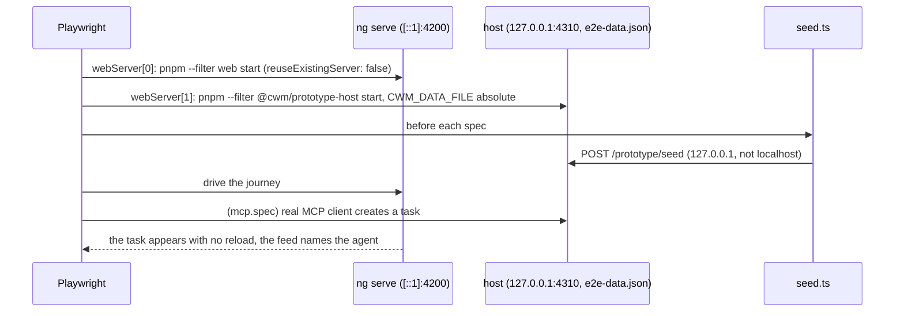

# What the testing system is made of

`apps/e2e/archived-projects.spec.ts` covers Settings recovery, persona isolation and the
disabled-Archive path beside `archive.spec.ts`'s ready-only root projection. Host acceptance
scripts check exact IDs over HTTP and both MCP transports; focused contract and domain tests
pin the structural eligibility and read result shapes.

## The layers

```mermaid
flowchart TB
  subgraph offline["pnpm test — offline, browser-free; isolated localhost ports and temp files"]
    roadmap["root: roadmap and documentation guards (node:test)"]
    c["contracts: schema accept/reject"]
    r["repositories: store, unit of work, integrity, query semantics"]
    d["domain: every rule over InMemoryDataStore + PrototypeClock"]
    m["mcp-tools: registry, contract per tool, activity, errors"]
    p["prototype-data: seeds parse and match snapshots; converter"]
    h["host: routes, errors, auth, hub, SSE, MCP handler, stdio, concurrency, live frames"]
    w["web: stores and components with fake gateway and fake live updates"]
  end
  subgraph lint["pnpm lint"]
    tsc["tsc --noEmit in every workspace (app, spec and storybook configs in web)"]
    imp["check-package-imports.mjs (domain, mcp-tools)"]
    date["check-no-direct-date.mjs (domain)"]
    tok["check-design-tokens.mjs + expect-failure.mjs (web)"]
    docs["check-docs.mjs (documentation structure)"]
  end
  subgraph real["Run deliberately"]
    acc["acceptance scripts: second host on a temp file"]
    sb["Storybook: TaskRow, ProjectSectionFrame, canvas, history controls, creation recovery, recovery notice, navigation, pages, shortcuts, archive"]
    e2e["Playwright: web, project creation history, section edit/removal Undo, MCP, todos, archive, reflections — own servers, own data file"]
    use["§77: use it in the real app; notes.json"]
  end
```

## The e2e suite

```mermaid
sequenceDiagram
  participant PW as Playwright
  participant W as ng serve ([::1]:4200)
  participant H as host (127.0.0.1:4310, e2e-data.json)
  participant S as seed.ts
  PW->>W: webServer[0]: pnpm --filter web start (reuseExistingServer: false)
  PW->>H: webServer[1]: pnpm --filter @cwm/prototype-host start, CWM_DATA_FILE absolute
  PW->>S: before each spec
  S->>H: POST /prototype/seed (127.0.0.1, not localhost)
  PW->>W: drive the journey
  PW->>H: (mcp.spec) real MCP client creates a task
  W-->>PW: the task appears with no reload, the feed names the agent
```

## Inventory

| Part | Path | Role |
|---|---|---|
| Package suites | `packages/*/src/*.test.ts`, `apps/prototype-host/**/*.test.ts` | vitest, in-process |
| Root tooling suite | `scripts/roadmap.test.mjs`, `scripts/check-docs.test.mjs` | node:test, roadmap Outcome and built Compodoc anchor validation |
| Test support | `packages/domain/test/test-support.ts`, `packages/mcp-tools/test/harness.ts` | Store, clock, actor builders; persist counting; foreign-workspace injection |
| Web specs and stories | `apps/web/src/**/*.spec.ts`, `*.stories.ts` | `ng test` (vitest under `@angular/build:unit-test`); Storybook |
| Fakes | `apps/web/src/app/core/gateway/testing/`, `core/live/testing/`, `prototype/control/testing/` | What every web spec injects |
| Import lint | `scripts/check-package-imports.mjs` | AST allowlist; `--allow`, `--label`, `--root` |
| Date lint | `packages/domain/scripts/check-no-direct-date.mjs` | §45; `time-lint.test.ts` proves it |
| Token lint | `apps/web/scripts/check-design-tokens.mjs`, `expect-failure.mjs` | §21; the self-test pins each fixture |
| Docs check | `scripts/check-docs.mjs`, `scripts/roadmap.mjs check` | The documentation protocol's rules |
| Acceptance | `apps/prototype-host/scripts/{acceptance,agent-acceptance,mcp-acceptance,live-acceptance}.mjs` | Slices 5, 13, 15, 16; `mcp-acceptance` also carries Slice 33's recovery, foreign-actor, grant-removal and revocation checks on both transports, Slice 37's `restore_section` and shortcut-tool envelopes and chains, Slice 38's `set_project_page_enabled` journey — receipt and `null` envelopes, exact ids, `projects.write` alone, another connection's not-found and a revoked connection's page receipt — Slice 39's project-update block on both transports, and Slice 45's task add → complete → rename → Delete chain with exact fields and cascade markers, reflection add/archive/restore, layout and progress Undo/Redo, and (Streamable HTTP, whose host has a simulated clock) Archive Restore after a removal's history expired |
| Recovery acceptance (host) | `apps/prototype-host/recovery-undo-acceptance.test.ts`, `live-updates.test.ts`, `page-history-acceptance.test.ts` | Real v2–v5 conversion/reopen and section chains over temp files; `live-updates.test.ts` adds commit-before-publish and the compound row Add fault matrix; `page-history-acceptance.test.ts` adds the optional-page commit boundary — recorder, action-update, cursor-update and persist failures in both directions, each asserting unchanged file bytes, history and zero frames — plus the applied/undone v5 reopen. Slice 45 adds canonical Restore races — task, subtask, reflection, section and project Restore under an archived owner, parent or ancestor over HTTP and the MCP registry — a removal Redo refused by a new row, and recorder/persist faults through the MCP tool path, each with unchanged memory, disk bytes and zero frames. Part of `pnpm test` |
| Row history chains | `packages/domain/src/row-history.test.ts`, `packages/prototype-data/src/upgrade-activity-identity.test.ts` | Task and reflection Undo/Redo chains, grants, compound containers and later-dependent refusals — since Slice 45 also task Delete over live and independently archived descendants, Undo of a task Restore, Undo Add absent from Archive, the task no-op and the reflection transition grant; the v4 → v5 Activity identity backfill |
| E2E | `apps/e2e/playwright.config.ts`, `prepare-data.mjs`, `seed.ts`, `web.spec.ts`, `canvas-editing.spec.ts`, `section-edit-undo.spec.ts`, `removal-undo.spec.ts`, `row-history.spec.ts`, `canvas-history.spec.ts`, `page-history.spec.ts`, `project-history.spec.ts`, `project-creation-history.spec.ts`, `history-controls.ts`, `mcp.spec.ts`, `todos.spec.ts`, `archive.spec.ts`, `archived-projects.spec.ts`, `reflections.spec.ts` | §69's journeys; `pree2e` refreshes the scratch document; Slice 36 adds browser commit boundaries, shared row history, live projections and compound implicit-container Undo/Redo, Slice 37 adds placement, Restore and duplication history with two-tab reconciliation, Slice 38 adds the optional-page toggle, its Open archive boundary, route fallback and blocked creation inverse, Slice 39 adds header project history and cross-root reparent refresh on Todos and Archive, Slice 41 adds header Undo/Redo, Slice 42 adds creation Undo, same-id Redo, same-URL recovery and cross-owner not-found, Slice 43 adds one-step removal and task Delete on both task surfaces, Slice 44 adds workspace Settings recovery, parent-first Archive and narrow touch checks, and Slice 45's `project-history.spec.ts` closure journeys add header controls with Archive disabled, populated off Home, contained and tapped at 375 px in both themes beside another persona, the exact-field task chain on a moving Clock, and layout, progress and shortcut-move history with Archive recovery after expiry, and Slice 47 adds the stale root-Archive pause through a held quiet frame and keyboard Retry, and Settings recovery focus (remaining row, revealed child, Retry, moved focus) by keyboard and tap in both themes |
| Milestone walkthrough | `docs/guides/first-milestone-walkthrough.md` | The manual click-path for every §81 bullet |
