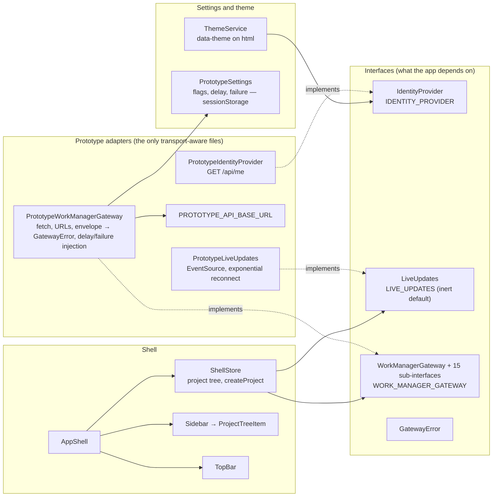
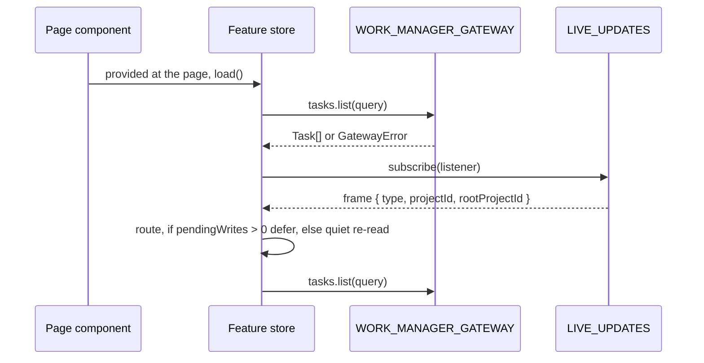

# What core is made of

## Structure

## Sub-interfaces of `WorkManagerGateway`

`tasks`, `projects`, `dashboard`, `progress`, `timeline`, `todos`, `archive`, `journal`,
`reflections`, `projectPages`, `sections`, `sectionShortcuts`, `agents`, `activity`, `history` — each
a small interface in `work-manager-gateway.ts`, each with a fake in `gateway/testing`.
A member exists only when an implementation and a caller exist.

The section gateway returns shared contracts rather than bare entities: create returns
`SectionAddResult`, update and move return `SectionWriteResult`, `history.summary` returns the
caller's `OperationHistorySummary`, and `history.transition` returns
`OperationHistoryTransitionResult`. The adapter validates those envelopes at the HTTP boundary, so
no component imports a transport type or reconstructs a receipt. The fake gateway keeps a one-history
stand-in that runs each write's Undo by action id; ordering and conflicts are the host's rules,
proved there.

## A store's three connections

## Inventory

| Part | Path | Role |
|---|---|---|
| `WorkManagerGateway`, sub-interfaces, `WORK_MANAGER_GATEWAY` | `core/gateway/work-manager-gateway.ts` | §9's shape as the app sees it |
| `GatewayError` | `core/gateway/gateway-error.ts` | The one failure type; `details` preserved |
| `PrototypeWorkManagerGateway` | `core/gateway/prototype-work-manager-gateway.ts` | §10's adapter |
| Fakes | `core/gateway/testing/`, `core/live/testing/` | What every component and store spec injects |
| `IdentityProvider`, `IDENTITY_PROVIDER`, `PrototypeIdentityProvider` | `core/identity/` | §18 |
| `LiveUpdates`, `LIVE_UPDATES`, `PrototypeLiveUpdates` | `core/live/` | §62 client side |
| `PROTOTYPE_API_BASE_URL` | `core/config/prototype-config.ts` | Where the host is |
| `PrototypeSettings`, `PrototypeFlags`, `StoredSettings` | `core/config/prototype-settings.ts` | §47 flags; delay; failure rate |
| `ThemeService` | `core/theme/theme-service.ts` | §22 |
| `AppShell`, `ShellStore`, `ProjectTreeNode` | `core/shell/` | §23 layout and the project tree |
| `Sidebar`, `ProjectTreeItem`, `TopBar` | `core/shell/sidebar/`, `core/shell/top-bar/` | Presentational |
