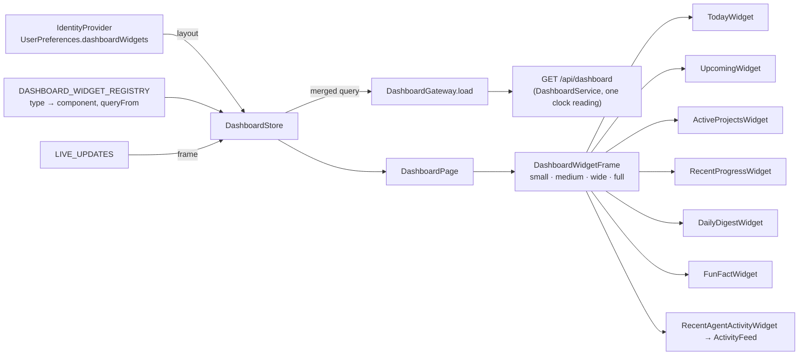

# What the dashboard is made of

## Structure

## Inventory

| Part | Path | Role |
|---|---|---|
| `DashboardPage` | `dashboard-page.ts` | Renders each visible widget in its size; honest note for an unregistered type |
| `DashboardStore` | `dashboard-store.ts` | Joins layout and content; re-reads on frames |
| `DASHBOARD_WIDGET_REGISTRY`, `DashboardWidgetDefinition`, `DashboardWidgetComponent`, `DashboardWidgetInputs` | `widgets/registry.ts`, `widgets/widget-contract.ts` | The list and the contract every widget implements |
| `DashboardWidgetFrame` | `widgets/widget-frame/` | The common chrome and size classes |
| Seven widgets | `widgets/{today,upcoming,active-projects,recent-progress,daily-digest,fun-fact,recent-agent-activity}/` | One folder each; shared `widget-content.scss` |
