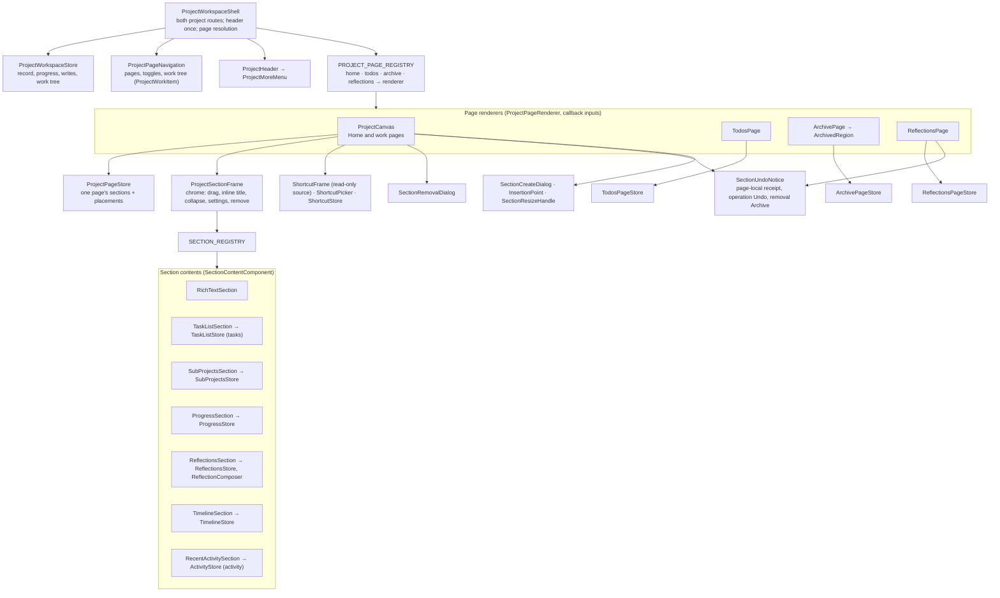
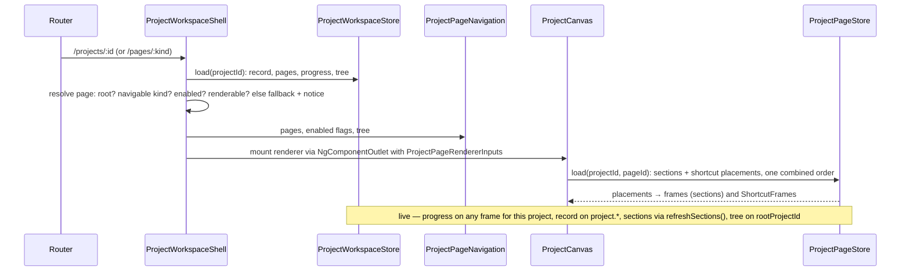

# What the projects feature is made of

## Structure

## Opening a root's Home

## Inventory

| Part | Path | Role |
|---|---|---|
| `ProjectWorkspaceShell` | `project-workspace-shell.ts` | Both routes; header; page resolution and fallback notice; breadcrumbs for a subproject |
| `ProjectWorkspaceStore`, `WorkTreeNode` | `project-workspace-store.ts` | Project-level state and writes |
| `ProjectPageNavigation`, `ProjectWorkItem` | `project-page-navigation.ts`, `project-work-item.ts` | The column and its rows |
| `ProjectHeader`, `ProjectMoreMenu` | `project-header.ts`, `project-more-menu.ts` | Name, status, progress, target date; rename/status/date/archive |
| `PROJECT_PAGE_REGISTRY`, `ProjectPageDefinition` | `project-page-registry.ts` | Navigable kinds → renderer and label |
| `ProjectPageRenderer`, `ProjectPageRendererInputs` | `project-page-contract.ts` | What every renderer receives |
| `ProjectCanvas` | `project-canvas.ts` | One page's canvas: contextual insertion, drag-drop, snapped resize, explicit edit receipts, removal dialog and arrival at `#section-<id>` |
| `ProjectPageStore`, `CanvasWriteResult`, `SectionRemovalPrompt`, `SectionUndoNoticeState` | `project-page-store.ts` | Sections and placements of one page; positioned creation, typed refusal and sequence-selected operation receipt state |
| `SectionRemovalDialog` | `section-removal-dialog.ts` | Cascade or reassign, containers by name |
| `SectionUndoNotice` | `section-undo-notice.ts` | Accessible operation Undo, removal-only Archive, explicit retry after uncertain removal, refresh retry and typed refusal guidance |
| `SectionCreateDialog` | `section-create-dialog.ts` | Section or Home shortcut creation at the selected canvas position |
| `CanvasIcon`, `InsertionPoint`, `SectionResizeHandle`, `gridInsertionGaps`, `moveDirectionFor` | `canvas-chrome/` | Shared SVG canvas controls, insertion overlays, snapped resize, sparse-grid gap targets and grip move keys |
| `TodosPage`, `TodosPageStore` | `pages/todos-page*.ts` | §34's chronology with inline completion and canonical links |
| `ArchivePage`, `ArchivePageStore`, `ArchivedRegion` | `pages/archive-page*.ts`, `archived-region/` | §31's root-wide content projection, recovery copy and restores |
| `ReflectionsPage`, `ReflectionsPageStore` | `pages/reflections-page*.ts` | §36's page, the completed-work picker, the journal; explicit Add container holds a page-local add receipt and reuses `SectionUndoNotice` |
| `SECTION_REGISTRY`, `SectionDefinition` | `sections/registry.ts` | §29 |
| `SectionContentComponent`, `SectionContentInputs` | `sections/section-contract.ts` | What every content component receives |
| `ProjectSectionFrame` | `sections/section-frame/` | §31's always-available drag, collapse, inline title, optional inspector and remove controls |
| Seven section types | `sections/{rich-text,tasks,sub-projects,progress,reflections,timeline,activity}/` | Content components and their stores |
| `ShortcutFrame`, `ShortcutPicker`, `ShortcutStore` | `shortcuts/` | §27's Home shortcuts |
