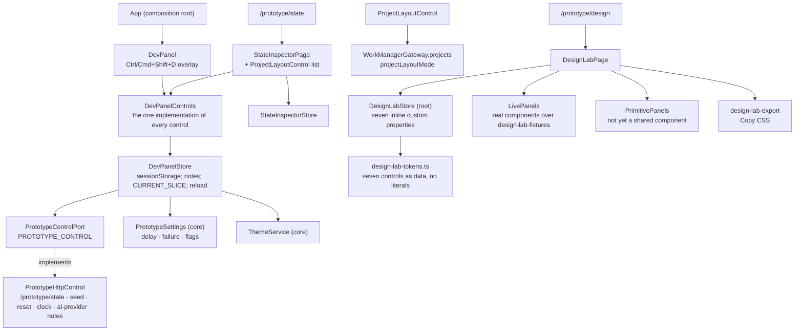

# What the prototype tooling is made of

## Structure

## The controls

| Control | Where it takes effect | Reloads the tab? |
|---|---|---|
| Persona | host header via `PrototypeIdentityProvider`; a new session | yes |
| Seed | host `/prototype/seed` through the unit-of-work lock | yes |
| Current Date | host `/prototype/clock` (`SimulatedClock.setNow`) | yes |
| AI Provider | host `/prototype/ai-provider` | yes |
| Theme | `ThemeService` signal; not stored | no |
| Layout Mode | a real project field through the gateway | no |
| Network Delay, Failure Rate | `PrototypeSettings` → the gateway adapter; `sessionStorage` | no |
| Feature Flags | `PrototypeSettings`; `sessionStorage`; two of six gate something today | no |
| Agent Connection | read-only roster with copyable tokens, from `/prototype/state` | no |
| Add Prototype Note | host `/prototype/notes` with route, project, `CURRENT_SLICE` | no |

## Inventory

| Part | Path | Role |
|---|---|---|
| `PrototypeControlPort`, `PROTOTYPE_CONTROL` | `control/prototype-control.ts` | The interface and token |
| `PrototypeHttpControl` | `control/prototype-http-control.ts` | The adapter over `/prototype/*` |
| Fake | `control/testing/` | What specs inject |
| `DevPanel`, `DevPanelControls` | `dev-panel/dev-panel.ts`, `dev-panel-controls.ts` | Overlay and the shared controls |
| `DevPanelStore`, `CURRENT_SLICE`, `StoredSettings` | `dev-panel/dev-panel-store.ts` | Panel state, notes, reload rule |
| `StateInspectorPage`, `StateInspectorStore`, `ProjectLayoutControl` | `dev-panel/state-inspector-page.ts`, `state-inspector-store.ts`, `project-layout-control.ts` | §68's inspector and §28's list |
| `DesignLabPage`, `DesignLabStore`, `DesignLabToken`, `DesignLabExport` | `design-lab/` | §67 |
| `LivePanels`, `PrimitivePanels`, `SectionCanvasFrame`, `StubSectionContent` | `design-lab/panels/`, `design-lab/section-canvas-frame.ts` | The catalogue |
| Fixtures | `design-lab/design-lab-fixtures.ts` | The data the live panels render |
