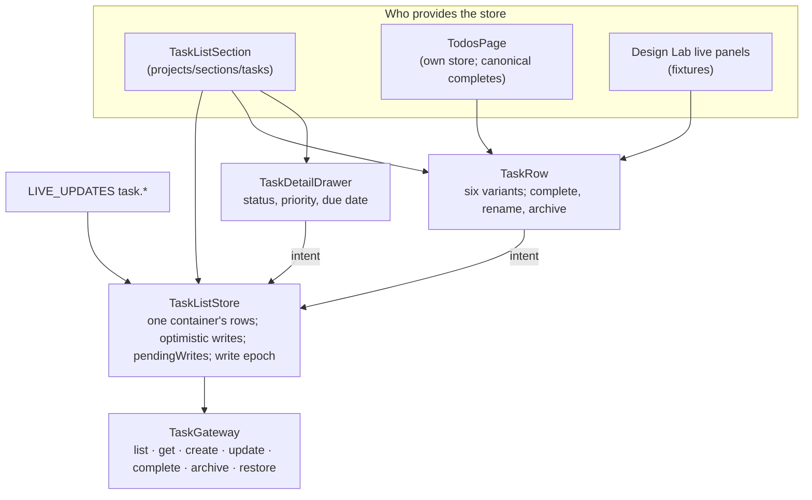
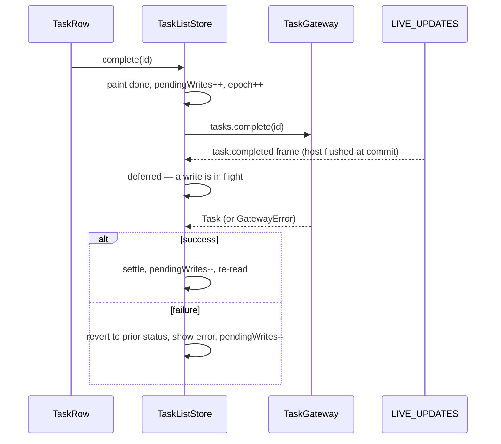

# What the tasks feature is made of

## Structure

## Optimistic completion

## Inventory

| Part | Path | Role |
|---|---|---|
| `TaskRow` | `task-row.ts`, `.html`, `.scss`, `.stories.ts` | The row and its six §4 variants; `pending` and `archiving` are separate |
| `TaskDetailDrawer` | `task-detail-drawer.ts` | Side drawer editing |
| `TaskListStore` | `task-list-store.ts` | One container's rows; optimistic writes; quiet live re-reads |
