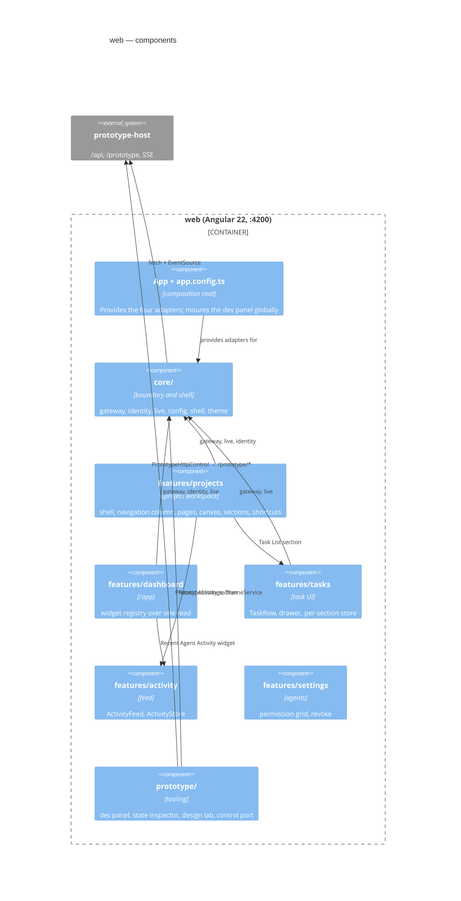
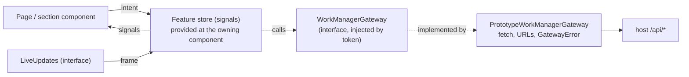

# What the web app is made of

## Components

`core/` never depends on `prototype/`: the dev panel hangs off `App`, the view's
composition root, which is the one place a development surface may attach to a
production-shaped shell.

## The route map (§68)

| Route | Component | Notes |
|---|---|---|
| `/` | redirect → `/app` | `pathMatch: 'full'`, or it swallows every URL |
| `/app` | `DashboardPage` | |
| `/projects/:projectId/pages/:pageKind` | `ProjectWorkspaceShell` | Declared before the shorter route or it would never match |
| `/projects/:projectId` | `ProjectWorkspaceShell` | A root opens on Home; a subproject on its work canvas |
| `/calendar`, `/search` | placeholders | Slices 18 and 21 |
| `/settings`, `/settings/agents` | `SettingsPage`, `AgentConnectionsPage` | §53 |
| `/prototype/design` | `DesignLabPage` (lazy) | §67 |
| `/prototype/state` | `StateInspectorPage` (lazy) | §46, §68 |
| `**` | `NotFoundPage` | |

## Page → Store → Gateway (§19)

## Inventory

| Part | Path | Role |
|---|---|---|
| `App`, `appConfig`, `routes` | `src/app/app.ts`, `app.config.ts`, `app.routes.ts` | Bootstrap, adapters, route map |
| Core | `src/app/core/` | [core](core/overview.md) |
| Projects | `src/app/features/projects/` | [projects](projects/overview.md) |
| Dashboard | `src/app/features/dashboard/` | [dashboard](dashboard/overview.md) |
| Tasks | `src/app/features/tasks/` | [tasks](tasks/overview.md) |
| Prototype tooling | `src/app/prototype/` | [prototype-tooling](prototype-tooling/overview.md) |
| Activity | `src/app/features/activity/` | `ActivityFeed`, `ActivityStore` |
| Settings | `src/app/features/settings/` | `SettingsPage`; `agents/AgentConnectionsPage`, `AgentConnectionsStore` |
| Placeholders | `src/app/features/calendar/`, `features/search/`, `shared/components/placeholder-page/` | `CalendarPage`, `SearchPage`, `PlaceholderPage`, `NotFoundPage` |
| Tokens and base styles | `src/styles/_tokens.scss`, `_base.scss` | §21's custom properties, both themes, the knob layer |
| Storybook | `.storybook/` | `@storybook/angular-vite`; stories beside components |
| Lints | `scripts/check-design-tokens.mjs`, `scripts/expect-failure.mjs` | The token lint and its self-test |
