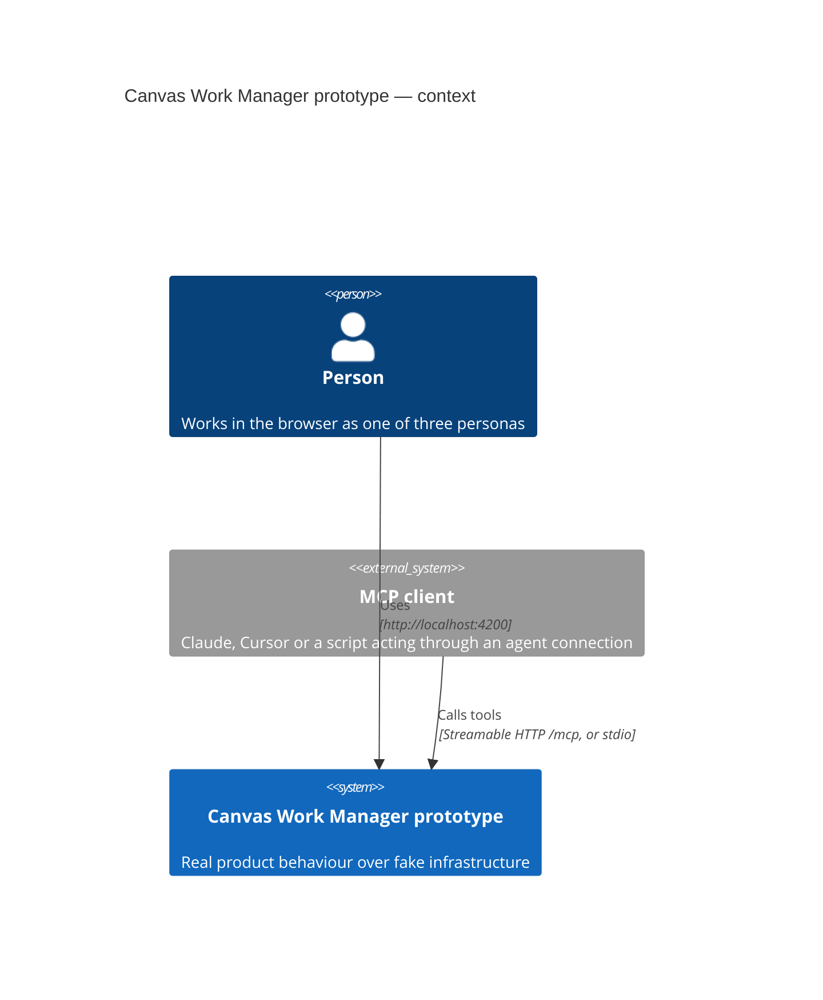
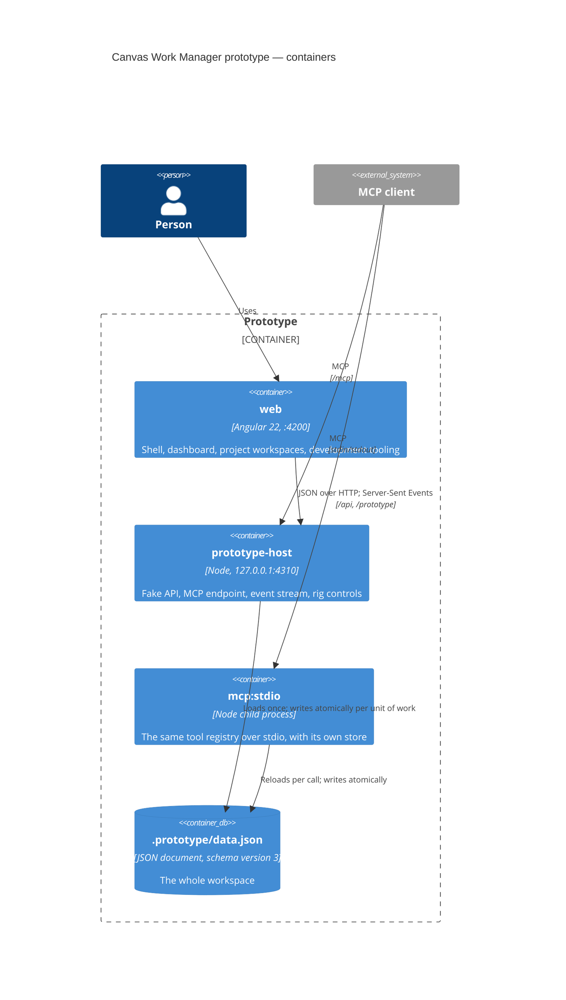
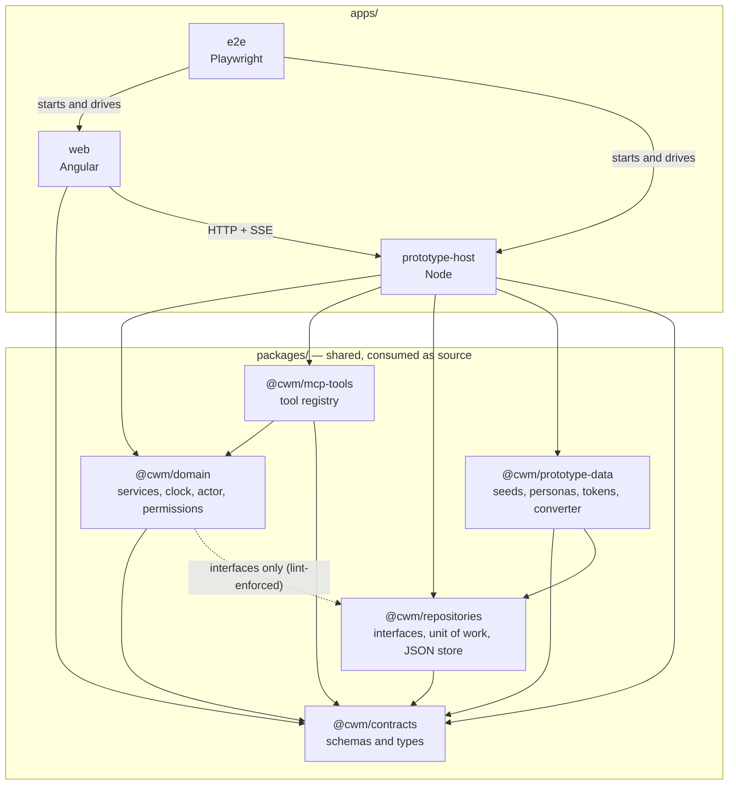
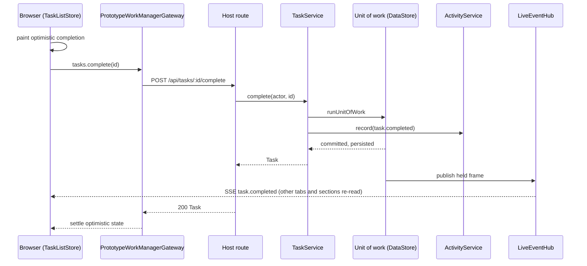

# What the prototype is made of

## Context

A person and an agent are both users. The agent authenticates with a fixture bearer token
that names an **agent connection** in the person's workspace; the connection's permissions
decide what the agent may do (§51–§53).

## Containers

The web app never touches the file. The host loads it once at start and writes it through
a temp-and-rename at the end of every unit of work (§15). A stdio process is a second
owner of the same file, which is why the two must not mutate concurrently
([guide](../guides/mcp-setup.md#important-file-store-limitation)).

## Packages and apps

Arrows are `package.json` dependencies, resolved to source through `tsconfig.base.json`'s
path aliases — there is no build step between packages. The dotted edge is the one that
needs judgement: the domain imports repository **interfaces** and nothing else from
`@cwm/repositories`; `scripts/check-package-imports.mjs` enforces the allowlist.

## A write through every layer

The same `TaskService.complete` is what an MCP `complete_task` call reaches, with an
`ActorContext` built from a bearer token instead of a persona header; the live frame is
identical.

## Inventory

| Part | Path | Role |
|---|---|---|
| `web` | `apps/web` | The Angular application — [web](web/overview.md) |
| `@cwm/prototype-host` | `apps/prototype-host` | The host process — [prototype-host](prototype-host/overview.md) |
| `@cwm/e2e` | `apps/e2e` | Playwright suite with its own servers — [testing](testing/overview.md) |
| `@cwm/contracts` | `packages/contracts` | [contracts](contracts/overview.md) |
| `@cwm/domain` | `packages/domain` | [domain](domain/overview.md) |
| `@cwm/repositories` | `packages/repositories` | [repositories](repositories/overview.md) |
| `@cwm/mcp-tools` | `packages/mcp-tools` | [mcp-tools](mcp-tools/overview.md) |
| `@cwm/prototype-data` | `packages/prototype-data` | [prototype-data](prototype-data/overview.md) |
| Seeds | `prototype/seeds/*.json` | Six committed snapshots, regenerated by the seed builders |
| Working files | `.prototype/` | `data.json` (git-ignored), `e2e-data.json`, `notes.json` (§79) |
| Scripts | `scripts/` | `dev.mjs` (prints the two commands), `check-package-imports.mjs`, `check-docs.mjs`, `roadmap.mjs` |
