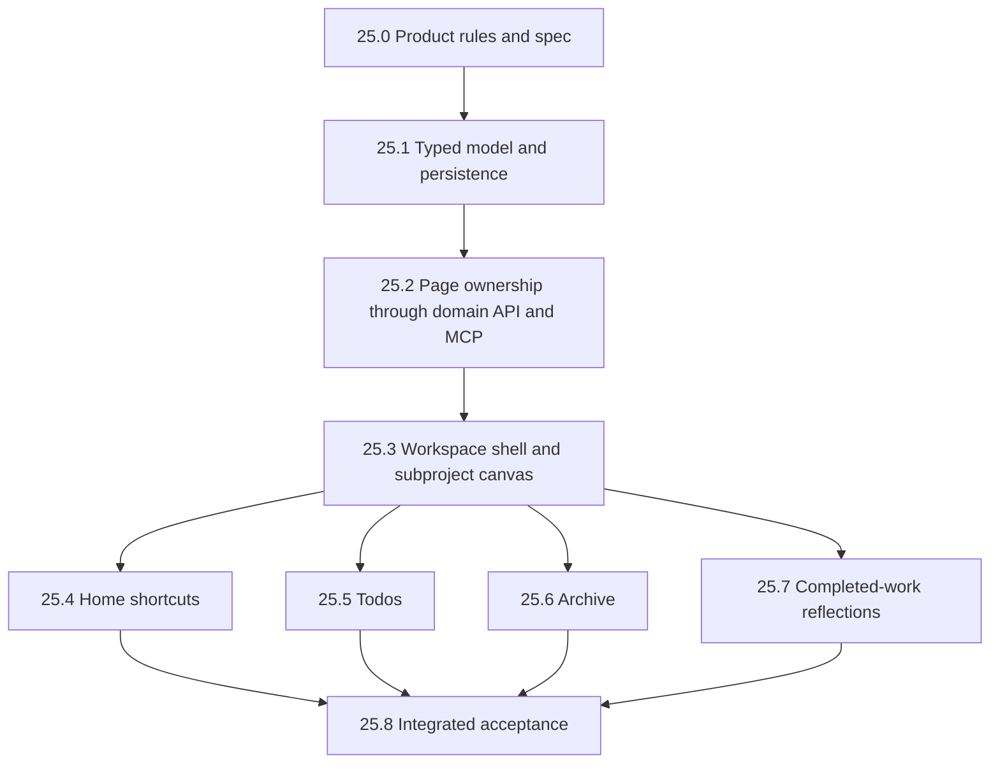

# Multi-page projects overhaul — dependency-aware implementation roadmap

**Status:** 25.0–25.3 done; 25.4 onward not started. This is a multi-phase roadmap, not authorization to implement every phase in one change. Before each phase, re-read its touched code and write its bounded implementation plan under the AGENTS.md protocol, including iterative review and red/green tests.

**Resolved in 25.0** (user, 2026-09-04 — recorded in [docs/decisions/2026-09-project-workspaces-and-subproject-work-units.md](../decisions/2026-09-project-workspaces-and-subproject-work-units.md)): the data cutover uses a bounded v2→v3 converter rather than a disposable reset; Archive means hidden from ordinary surfaces plus a whole-tree Archive page, with **Open archive** in project controls when the tab is disabled; Todos carries root tasks plus every descendant subproject and task, due date ascending with undated last and deterministic ties, retaining completed and cancelled rows. The two "clarification pending" rows in the table below are therefore settled as proposed.

## Goal

Make root projects configurable workspaces with pages, while subprojects become distinct, nestable, single-page units of work with descriptions, due dates, and the full existing canvas vocabulary.

## Source and current implementation

User-requested direction supersedes the old single-canvas product model. Relevant spec: §8–15 (boundaries, contracts, persistence), §19–23 (stores, tokens, shell), §26–34 (project canvas, ownership and tasks), §35–39 (data and views), §45 (time), §52–55 and §57 (agent permissions/tools/activity), §61–63 (API/live updates/rollback), §68–69 (routes/tests), §77–79 (design loop/decisions), §80–83 (scope/milestones/questions). Phase 25.0 updates the affected product sections before implementation; these citations do not claim the existing spec already describes this overhaul.

Repository findings grounding the order:

- `packages/contracts/src/project.ts`: one `Project` schema, optional `parentProjectId`, description and date-only `targetDate`; no distinction between root workspace-project and subproject. Do not confuse a workspace-project with the existing authentication/persona `Workspace`.
- `packages/contracts/src/section.ts`: sections belong directly to `projectId`; tasks/reflections also carry `sectionId`. Preserve the recent ownership work: containers own data; views own no rows. Rich Text stores its content in section config.
- `packages/domain/src/project-service.ts`: hierarchy/cycle validation and archive-as-status exist; archive refuses live child projects. Completion has no dedicated timestamp. Status updates can reactivate a project; exact prior-status restoration does not exist.
- `packages/contracts/src/reflection.ts`: journal entries have no task/subproject subject. Linking reflections to completed work requires a contract and domain change, not only a new page.
- `apps/web/src/app/features/projects/project-page.ts`: one header/canvas and a page-scoped `ProgressStore`. A source subproject's Progress shortcut cannot safely use that shared destination store.
- `apps/web/src/app/features/projects/archived-region/archived-region-store.ts`: current undo is direct-project-only, intentionally suppressing rows restored by an ancestor. A complete archive browser must expose those rows with blocked/ancestor restore guidance.
- `packages/domain/src/timeline-service.ts` includes descendants; `progress-service.ts` measures direct tasks. Do not silently unify these semantics while moving their rendering.
- `packages/contracts/src/document.ts`: schema version 2, stale-version rejection and reset workflow; no migration runner. Preserve live data during planning.

## Proposed product and model decisions

These are planning defaults, not claims of implemented behavior. Resolve the two explicitly ambiguous user phrases before dependent implementation.

| Area | Proposed rule |
|---|---|
| Root vs subproject | A Zod discriminated `Project` union, `kind: 'root' | 'subproject'`, with shared IDs/repository for economical references. Root cannot have a parent; subproject requires one, can parent another subproject, and cannot own workspace tabs. Separate named schemas and operations enforce different capabilities; a UI label or `parentProjectId` check alone is insufficient. |
| Work metadata | Subprojects expose description, optional due date (retain date-only `targetDate`, label it **Due date**), status and `completedAt`. Empty description/undated work remain valid. Completion is explicit and does not complete descendants automatically; reopening clears `completedAt`. Preserve existing root status/progress settings unless evaluation justifies a separate change. |
| Pages | Persist `ProjectPage` records with stable IDs, owner project, page kind, enabled state and canvas layout where applicable. Exactly one required enabled Home per root; at most one each Todos, Archive, Reflections. Each subproject has exactly one work canvas, with no tab-toggle API. |
| Page capabilities | Home and subproject work canvases support all seven currently registered sections. Reflections has its journal/subject feed and an owned reflections container for new entries. Todos and Archive are derived pages, not alternate owners of copied tasks. New page kinds require an explicit capability entry and renderer, not a generic page-builder framework. |
| Ownership | Project → page → owned section → owned row. Preserve `projectId` and `sectionId` on rows; derive their page from the section. Integrity checks enforce agreement. Subprojects belong to their parent work hierarchy, not to a page or Sub-Projects view. Sections reorder within a page. |
| Optional toggles | Project-wide persisted navigation preferences; default new roots to Home only. Disabling a page retains its content, layout and references. Existing URLs to disabled pages fall back to Home with an explanation and re-enable entry point. Home cannot be disabled. |
| Default writes | With no section/page supplied, root task/reflection writes resolve a matching container on Home; subproject writes resolve on its sole canvas. With a page explicitly supplied, resolve there only if that page accepts that data kind. An explicit section is authoritative but must agree with any supplied page/project. Never silently write to a hidden page. Reflections-page composer explicitly names its owning container. |
| Shortcuts | Persist a separate placement referencing a canonical source section by ID, with destination Home page and its own position/collapse/span. No copied rows or source config. One combined ordering of sections and shortcut placements on Home. Support sources in other pages of the same root or any depth of its subprojects. No cross-root/cross-persona targets, self-reference, or shortcut-to-shortcut chains. |
| Shortcut interaction | Label creation **Add shortcut**. Render live source content and identify its origin. Initially source content is read-only, with **Open source** for editing; placement layout remains editable. Removing the placement never archives the source. A hidden source page remains referenceable; an archived source shows an unavailable placeholder without archived content. Restore revives the reference. |
| Todos (clarification pending) | Proposed: all descendant subprojects and tasks plus root tasks, sorted due date ascending; undated last; deterministic ties by kind and ID. Date-only subproject dates compare to task due dates using the existing calendar/time convention, with explicit timezone tests. Show completion state and retain completed/cancelled rows unless the user chooses an open-work-only list; exclude archived entities and anything beneath archived ancestors. Include origin breadcrumbs and navigate to canonical owners. |
| Archive (clarification pending) | Interpret “do not display” as hide archived work from ordinary pages and views. Optional Archive displays all archived sections, tasks, reflections and subprojects across the root tree, including blocked descendant rows. Disabling Archive leaves **Open archive** in project controls that enables/navigates to it, so undo remains reachable. If the phrase instead means hide the Archive tab for now, retain the current undo region until that tab is released. |
| Project/subproject archive | Keep current refusal when live child subprojects exist; no implicit project cascade. Exclude a project's live contents from ordinary reads while its status is archived. Archive browser may show those contents under their archived owner, clearly distinguishing effective hiding from their own archive flags. Reactivation is explicit status selection; section/task restore keeps existing exact-cascade markers. |
| Reflections | Add optional subject union `{ kind: 'task' | 'subproject', id }`, validated within the owning root tree. Subject is separate from the reflection's owning container. Completed-work composer requires a currently completed subject; general journal entries remain supported. Existing reflections survive a subject being reopened or archived and retain their association, with a state label. Feed is newest reflection first, with a separate completed-work picker; it does not silently discard historical reflections when status changes. |

“All regular data types and views” means the currently implemented registry, with equivalent ownership support for later registry additions. Milestones already have project-scoped persisted records and Timeline rendering: retain them for both owner kinds, but do not pull forward Slice 19's milestone editing/container UI, Slice 18 Calendar, or Slice 24 AI Summary.

## Dependency graph and delivery gates

Critical foundation: **25.0 → 25.1 → 25.2 → 25.3**. After that, the four feature branches can be developed independently once shared contracts are settled. Shared files (`inputs.ts`, gateway, route table, service composition, registry, seeds) still require a single integration owner and sequential edits. Suggested delivery order is Archive, Todos, Reflections, then Shortcuts, so the undo surface is established early. Every phase ends green and usable without waiting for 25.8.

## File-level work and test-first acceptance by phase

Paths are repository-relative. Files marked **new** do not exist yet. For each listed implementation file, modify/add its adjacent existing-style `.test.ts` (packages/host) or `.spec.ts` (Angular) when named test cases below exercise it. Maintain package `src/index.ts` exports when adding contracts/services. Each child phase plan must enumerate its exact tests and fixture files before editing, rather than treating this roadmap as a license for a repository-wide sweep.

### 25.0 — Settle semantics and amend the spec

**Depends on:** nothing. **Spec:** §23, §26–34, §36, §54, §68, §78, §81–83.

- Modify `Canvas Work Manager — Prototype Product, Design & Development Specification.md` at those sections to distinguish roots/work units, pages/shortcuts, reflection subjects and the revised archive location. Describe intended product behavior without claiming implementation is done.
- Add `docs/decisions/2026-09-project-workspaces-and-subproject-work-units.md` in Question / Options tested / What we learned / Current decision / Confidence / Revisit when format. State that model options were evaluated from code, not browser-tested.
- Update `development.md` and this roadmap with resolved choices and not-started phase statuses.

**Acceptance:** every ambiguous rule above is resolved or explicitly accepted as a prototype hypothesis; schema/route examples agree with the decision; each requested behavior maps to a later phase. No runtime tests for prose. Resolve Archive wording and Todos scope/order here. Also validate the proposed read-only shortcut interaction, optional metadata and default toggles with the implementation's design review; escalate only if the answer changes the work's shape.

### 25.1 — Distinguish owner kinds and introduce persistent pages

**Depends on:** 25.0. **Spec:** §11–15, §26–28, §33, §45.

- Modify `packages/contracts/src/project.ts`, `section.ts`, `ids.ts`, `document.ts`, `inputs.ts`; add **new** `packages/contracts/src/project-page.ts`. Add discriminated roots/subprojects, `ProjectPageId`, page capabilities, completion timestamp, page collection and required section `pageId` in one schema-version cutover. Reserve the initially empty shortcut collection in this cutover, with its reference-only placement schema in **new** `packages/contracts/src/section-shortcut.ts`; no shortcut operations exist yet. This avoids a second destructive load break in 25.4.
- Modify `packages/repositories/src/interfaces.ts`, `json-repositories.ts`, `data-store.ts`: page repository and integrity rules for unique Home/work canvas, one optional kind, same-workspace parent tree, no cycles, immutable owner kind and page capability validation.
- Modify `packages/domain/src/project-service.ts`, `section-service.ts`, `apps/prototype-host/persistence/store.ts`, `apps/prototype-host/api/services.ts`: atomic owner plus canonical page creation; enforce subproject parent eligibility and explicit completion/reopen behavior. Make the minimum section-create/duplicate changes to populate required `pageId` from the canonical page so old callers remain functional. Wider page selection and operations belong to 25.2.
- Modify `packages/prototype-data/src/seeds.ts`, `seeds.test.ts`, and all six `prototype/seeds/{empty,personal-workspace,busy-week,nested-projects,overdue-chaos,agent-heavy}.json`; update shared fixture factories `packages/domain/test/test-support.ts`, `packages/mcp-tools/test/harness.ts`, `apps/e2e/seed.ts`, `apps/web/src/app/core/gateway/testing/fake-gateway.ts` as required by the new schema.

**Data cutover gate:** prefer a single bounded v2→next-version converter preserving IDs, content, archive markers and order: roots gain Home; old nested projects become subprojects with a work canvas; old sections land on that canvas. Add **new** `packages/prototype-data/src/upgrade-project-pages.ts` and its test, plus a documented explicit CLI entry in `packages/prototype-data/package.json`. Validate before atomic write; keep a backup; already-upgraded input is a no-op; unsupported versions fail clearly. Do not auto-reset live data. If disposable-data reset is preferred, obtain that decision in 25.0 and remove the converter from scope, with an explicit backup/reset checklist. No general migration framework.

**Tests first:** `root cannot have parent`; `subproject needs a same-workspace live parent`; `cycle and kind conversion rejected`; `root gets exactly one Home atomically`; `subproject cannot gain tabs`; `completion uses Clock and reopening clears timestamp`; `v2 conversion preserves archived ownership and IDs`; `invalid conversion leaves original unchanged`.

**Done when:** converted nested seed reloads and validates; existing project/task flows still function via default canvases; a failed create leaves neither an orphan owner nor orphan page. Contract/domain/repository/seed checks and build are green. No new navigation yet.

### 25.2 — Page-aware ownership end to end

**Depends on:** 25.1. **Spec:** §8–13, §29–34, §52–55, §57, §61–63.

- Modify `packages/contracts/src/inputs.ts` to expose page selection/filtering over the required section `pageId` landed in 25.1. Add **new** `packages/domain/src/project-page-service.ts` for list/toggle/page operations through repositories, with no reverse service edge into ProjectService.
- Modify `packages/domain/src/section-service.ts`, `task-service.ts`, `reflection-service.ts` for page-scoped create/default resolution/reorder/duplicate/restore. Preserve existing acyclic row-service → SectionService composition. Default resolution must work for `tasks.write` or `reflections.write` alone, without granting general layout writes.
- Modify `packages/repositories/src/data-store.ts`, `json-repositories.ts`, `interfaces.ts` to enforce/query page ownership. Wire `apps/prototype-host/api/services.ts`, `routes.ts`, `persistence/store.ts`.
- Modify `packages/domain/src/workspace-service.ts`, `dashboard-service.ts`, `timeline-service.ts`, `progress-service.ts`, plus canonical list/write guards, to consistently exclude archived owners and descendants of archived ancestors from ordinary content reads and refuse writes beneath archived ancestors. Explicit archive queries remain available. Preserve each read model's existing direct/descendant scope and progress formula. Land this shared visibility prerequisite here so Archive can ship before Todos; test archived selected roots as well as archived intermediate ancestors.
- Modify `apps/web/src/app/core/gateway/work-manager-gateway.ts`, `prototype-work-manager-gateway.ts`, `testing/fake-gateway.ts`: shared-contract page operations and section page filters, preserving default-canvas callers.
- Modify `packages/mcp-tools/src/tools/projects.ts`, `sections.ts`, `tasks.ts`, `reflections.ts`, `tool.ts`, `registry.ts`; add **new** `tools/project-pages.ts` if separate page tools make capability distinctions clearer. Update `docs/mcp-setup.md`. Root and subproject creation must be explicit/discoverable in schemas and descriptions; reject contradictory kind/parent combinations. Keep a documented compatibility mapping for old parent-based create calls only if 25.0 chooses it.
- Modify `packages/contracts/src/live.ts`, `packages/domain/src/live-events.ts`, `activity-service.ts` only as needed for root/page invalidation metadata. Publish after commit through the existing event mechanism. Nested changes must invalidate the root's aggregate pages, not just the immediate owner.

**Tests first:** `Home and Reflections page own different reflection containers`; `root and subproject task lists remain distinct`; `default writes appear on visible canonical canvas`; `explicit section/page mismatch rejected`; `reorder does not renumber another page`; `duplicate stays on owning page`; `cannot remove required page`; `toggle is nondestructive`; `write-only agent can create a row with implicit container`; `foreign owner/page returns not found`; `failed write emits no live event`; `root receives descendant invalidation`.

**Done when:** HTTP and MCP create a root, nested subproject and page-owned task/reflection, and list the same ownership; restart preserves it. Add route/registry contract cases for permitted and denied actions, including rejection of task containers on the Reflections page. A document written by 25.1 loads unchanged. No transport calls in domain or concrete gateway imports in components.

### 25.3 — Secondary sidebar, Home and single-page subprojects

**Depends on:** 25.2. **Spec:** §19–23, §26–32, §63, §68–69.

- Modify `apps/web/src/app/app.routes.ts`; `/projects/:projectId` resolves root → Home and subproject → sole canvas. Canonical root page route: `/projects/:projectId/pages/:pageKind`; subproject route remains `/projects/:projectId`. Reject cross-kind routes and handle unknown/disabled kinds deliberately.
- Modify `apps/web/src/app/core/shell/app-shell.{ts,html,scss}`, `shell-store.ts`, `sidebar/sidebar.{ts,html,scss}`, `sidebar/project-tree-item.ts`: preserve existing global sidebar and show a second adjacent navigation column in project context. On a subproject, keep its root context and provide breadcrumbs back through parents. At narrow widths collapse the secondary column behind a labeled control. Use tokens and keyboard-accessible links with active state.
- Add **new** `apps/web/src/app/features/projects/project-workspace-shell.{ts,html,scss}`, `project-workspace-store.ts`, `project-page-registry.ts`, `project-page-navigation.{ts,html,scss}`. Registry controls available page renderers; do not advertise Todos/Archive/Reflections before their phases land.
- Extract reusable canvas from `project-page.{ts,html,scss}` into **new** `project-canvas.{ts,html,scss}`; adapt `project-page-store.ts` to project + page identity and guarded async writes. Add **new** `subproject-page.{ts,html,scss}`; adapt `project-more-menu.{ts,html}` and `sections/sub-projects/sub-projects-{section,store}.ts` for description/due date/completion and nested work creation.
- Retain `archived-region` on current canvases until 25.6 supplies a working replacement. Keep all seven registry types, flow/grid, edit layout, container reassignment and failure rollback working on Home and subproject canvases.

**Tests first:** `root renders two sidebar columns and required Home`; `subproject has one canvas and no tab settings`; `description and due date persist`; `nested create returns to correct root context`; `refresh/back/forward preserve destination`; `late response from previous page cannot overwrite current page`; `failed toggle rolls back`; `unsupported or disabled tab safely routes Home`.

**Done when:** browser use on nested-projects creates and edits a work unit at depth three; Home and subproject render each registered type; page preference persists after reload; keyboard navigation and narrow-width navigation work. Add navigation/canvas Storybook states. Optional pages remain unavailable until their implementation passes.

### 25.4 — Add shortcut to Home

**Depends on:** 25.3. **Spec:** §11–15, §29–32, §52–55, §62–63.

- Extend `packages/contracts/src/section-shortcut.ts` (placement schema/empty collection landed in 25.1) with resolved-result schemas and mutation inputs in `inputs.ts`; add shortcut repository support in `interfaces.ts`, `json-repositories.ts`, `data-store.ts`. Keep documents produced by 25.1 loadable unchanged.
- Add **new** `packages/domain/src/section-shortcut-service.ts`; validate destination Home, source root ancestry and visibility through repositories. Wire host `services.ts`, `routes.ts`, `persistence/store.ts`, gateway and **new** `packages/mcp-tools/src/tools/shortcuts.ts` plus registry/context. Resolve source content through authorized domain reads, never repositories from MCP. Discover metadata under `projects.read`; loading task/reflection content requires its corresponding read permission. A layout grant cannot leak data through shortcut resolution.
- Add **new** `apps/web/src/app/features/projects/shortcuts/shortcut-picker.{ts,html,scss}`, `shortcut-frame.{ts,html,scss}`, `shortcut-store.ts`. Picker shows other source pages/subproject breadcrumbs and canonical section names; **Add shortcut** creates a placement. Adapt `project-canvas`, `project-page-store.ts`, `sections/section-contract.ts`, `sections/section-frame/project-section-frame.ts` for source identity versus placement identity and read-only content mode.
- Modify `sections/progress/progress-section.ts` and `progress-store.ts` provider ownership so each source context is isolated; audit Tasks, Reflections, Rich Text, Timeline, Sub-Projects and Activity inputs/callbacks for source-context reads and disabled mutations. Never pass destination project ID as the source.

**Tests first:** `shortcut renders canonical source without copying rows`; `two source Progress views stay independent`; `removing shortcut preserves source`; `placement reorder/collapse leaves source unchanged`; `cross-root and shortcut-chain references rejected`; `projects.read cannot reveal task/reflection content`; `source edit refreshes Home`; `archive hides source content and restore revives it`; `disabled source page retains live shortcut`; `failed placement save rolls back`.

**Done when:** Home shows a Task List from a nested subproject and Reflections container from another root page; source edits appear live; source row counts remain unchanged; Open source and unavailable states work. Until another root page is released, test cross-page sources using valid fixtures without exposing an unfinished renderer.

### 25.5 — Chronological Todos page

**Depends on:** 25.3 and 25.0's order/scope decision. **Spec:** §33–34, §38, §45, §52, §62.

- Add **new** `packages/contracts/src/project-todos.ts` and `packages/domain/src/project-todos-service.ts` for a derived discriminated task/subproject list, ancestor scope, stable chronology and source location. Reuse repository abstractions; no copied task rows. Require both `projects.read` and `tasks.read` for the combined result, with tests that missing grants deny instead of leaking partial content.
- Wire `apps/prototype-host/api/{services,routes}.ts`, gateway pair, `packages/mcp-tools/src/tools/project-pages.ts`, registry/context.
- Add **new** `apps/web/src/app/features/projects/pages/todos-page.{ts,html,scss}`, `todos-page-store.ts`; register in `project-page-registry.ts`. Completion delegates to canonical task/subproject operations; rows include due date, status and origin. No drag reorder for a chronological projection.
- Reuse the owner-kind/archived-ancestor visibility rules established in 25.2; do not defer shared read-model corrections to this branch. Preserve each existing read model's declared scope and formulas; shortcuts never increase totals.

**Tests first:** `mixed due dates sort with undated last and deterministic ties`; `timezone boundary follows chosen date convention`; `nested work appears once`; `archived ancestor excludes descendants`; `foreign root cannot broaden query`; `read permission pair enforced`; `completion updates canonical row and list`; `failure rolls back`; `descendant MCP event refreshes open Todos`.

**Done when:** a deliberately scrambled seed produces the specified order through UI, HTTP and MCP; links open the correct owning canvas/container; totals and canonical row counts are unchanged.

### 25.6 — Root Archive page and reachable undo

**Depends on:** 25.3 and Archive wording decision. **Spec:** §31–34, §52–55, §62–63.

- Add **new** `packages/contracts/src/project-archive.ts`, `packages/domain/src/project-archive-service.ts`: root-tree archive query with explicit entity kind, origin, archive cause, and restore eligibility. Require grants for each content category returned; proposed initial combined endpoint requires projects/tasks/reflections read permissions. No new cascade semantics.
- Extend existing `project-service.ts`, `section-service.ts`, `task-service.ts`, `reflection-service.ts` only to close ancestor-active validation gaps and expose consistent restore refusals. Retain prior independent archive markers exactly. Reactivate subprojects through explicit status selection, not guessed prior status.
- Wire host routes/services, gateway, and add canonical archive/restore tools to `packages/mcp-tools/src/tools/{projects,sections,tasks,reflections}.ts`, with existing write permissions and activity attribution. Add archive query to page tools and document it.
- Add **new** `apps/web/src/app/features/projects/pages/archive-page.{ts,html,scss}`, `archive-page-store.ts`; reuse/adapt `archived-region/archived-region.{ts,html,scss}` and retire its direct-only store once replaced. Register page; remove old footer only now. Add Open archive to project controls and subproject navigation context.

**Tests first:** `all archived descendants listed once including blocked rows`; `independently archived child stays archived after ancestor restore`; `blocked restore gives canonical ancestor guidance`; `reactivation failure leaves controls blocked`; `hidden Archive can be reopened after removal`; `normal Home/Todos/shortcuts exclude archived content`; `cross-persona query rejected`; `restore permission enforced through MCP`.

**Done when:** archive a nonempty section and a task with descendants, find both from root Archive, restore exactly the cascade members, and find/reactivate an archived subproject. Reload and repeat through MCP; no archive becomes unreachable when a tab is disabled. Permanent deletion and bulk restore remain deferred.

### 25.7 — Reflections for completed work

**Depends on:** 25.3 (including 25.1 completion semantics). **Spec:** §11–12, §36, §45, §52–55, §62–63.

- Modify `packages/contracts/src/reflection.ts`, `inputs.ts`, `packages/repositories/src/data-store.ts`, `json-repositories.ts` for optional typed subject, root-tree integrity and filtering; legacy general reflections remain valid.
- Modify `packages/domain/src/reflection-service.ts`: same-root subject existence, eligible completion on new subject assignment, independent container ownership, and historical retention after reopen/archive. Inject task repository for validation; no new TaskService↔ReflectionService cycle. Subject picker requires projects/tasks read grants; create validates internally without unnecessarily requiring read grants in addition to reflections.write.
- Wire host routes, gateways and `packages/mcp-tools/src/tools/reflections.ts`; update schema descriptions so agents can discover and attach subjects.
- Add **new** `apps/web/src/app/features/projects/pages/reflections-page.{ts,html,scss}`, `reflections-page-store.ts`; adapt `sections/reflections/reflections-{section,store}.ts` to show subject identity/status and reuse composition controls. Register page; default composer explicitly resolves its page container. Feed aggregates reflections from Home, the Reflections page and descendant canvases without moving them.

**Tests first:** `reflection can target completed task or subproject`; `unfinished/foreign/missing subject rejected`; `journal entry remains valid`; `subject does not change container ownership`; `reopened or archived subject keeps existing reflection visible with state`; `new write to archived owner refused`; `hidden page toggle preserves entries`; `agent write-only subject validation succeeds without leaking subject content`; `failed create leaves draft and no phantom row`.

**Done when:** complete a task and nested subproject, write one reflection for each, view both alongside existing journals on root Reflections, and reopen a subject without losing history. Create a subject-linked reflection through MCP and observe the live UI update.

### 25.8 — Integrated acceptance and documentation closure

**Depends on:** 25.4–25.7. **Spec:** §62–63, §69, §77–79, §81.

- Extend `apps/e2e/web.spec.ts`, `mcp.spec.ts`, `seed.ts` with the combined journey and permission/live-update paths; keep these outside `pnpm test`.
- Update `prototype/seeds/nested-projects.json` via the seed builder with multi-page roots, deep work units, undated/equal-date work, archived ancestors, linked reflections and shortcut sources. Add Storybook states beside new navigation/page/shortcut components.
- Update `docs/first-milestone-walkthrough.md`, `docs/mcp-setup.md`, `development.md`, the spec and affected decision entries; archive child implementation plans when complete. Update AGENTS.md only if orientation or architectural rules actually change. Record observed browser friction in `.prototype/notes.json`; do not invent findings from unit tests.

**Executable acceptance journey:** load realistic seed → create root → verify mandatory Home → enable optional pages → create subproject and nested subproject → edit description/due date → add each existing section kind to Home and a work canvas → add cross-page and nested-source shortcuts → verify chronology → complete task/subproject and reflect → archive/restore section/task/subproject → hide/re-enable pages → reload → perform equivalent key MCP mutations and watch browser refresh. Repeat key writes with injected failures and alternate persona/denied grants. All source data remains singly owned.

**Required checks:** targeted red/green checks per phase, including loading persisted documents written by the preceding phase whenever a stored shape changes; at final integration run `pnpm test`, `pnpm lint`, `pnpm build`, `pnpm storybook:build`, `pnpm e2e`. Start `pnpm dev:host` and `pnpm dev:web` separately for manual acceptance. Run checks once per relevant changed state; report skipped or blocked checks honestly. Obtain diff reviews for correctness/spec, boundaries, and acceptance/living docs, fix substantiated findings, then record actual browser/MCP observations.

## Boundaries and scope guards

- Components/stores call gateway interfaces. HTTP adapters and host composition own infrastructure. Domain uses repository abstractions, Clock and already-authorized acyclic service composition; new query/page services should use repositories directly instead of expanding the service graph unnecessarily.
- Contracts and permission-bearing query/result shapes live only in `packages/contracts`; MCP delegates to domain. A page or shortcut is never a permission bypass. All queries stay within the actor's existing Workspace and the chosen root tree.
- Persist at existing unit-of-work boundaries and publish live events after commit. Do not introduce queues, database infrastructure, a global mega-store or a separate synchronization framework.
- Use existing tokens/CDK and flow/grid settings. Optional page toggles are ordinary product state, not scattered prototype-mode branches.
- No arbitrary custom pages, cross-root shortcuts, editable embedded sources in the first shortcut pass, subtree moves across roots, root/subproject conversion, bulk archive, permanent deletion, auto-completing children, new task ordering, production services, Calendar/Milestone/AI feature expansion.

## Revisions

- Initial roadmap grounded in current contracts, services, ownership/archive decisions, route/shell/canvas implementation, gateway, MCP tools and package scripts. Explicitly separated archive browser work from existing undo semantics and linked reflections from existing journal ownership.
- Review round 1 found three substantive staging issues, all corrected: required section page ownership and the empty shortcut collection now share the initial version cutover; page-isolation tests use supported Home/Reflections containers; shared archived-owner visibility corrections moved into 25.2 so Archive has no hidden Todos dependency.
- Review round 2 returned no remaining substantive findings. Planning-only verification: checked the development index, dependency order, concrete existing path references and whitespace diff; no runtime code or live data changed, so application tests were not run.
- 25.0 review round 1 returned eight substantive findings, all corrected in the same phase: the subproject work canvas was missing from the spec's page model (it is a page record of kind `work`, not an exception to the ownership chain); three amended sections described unbuilt page ownership, page capabilities and default write resolution in the present indicative without a planned-slice marker; §83 claimed nested projects were "answered by use" when the decision came from code and user direction; §82's framing called the overhaul an observed finding rather than a user-requested direction; §34 dropped `cancelled` from the Todos retention rule the user actually chose; the roadmap's "keep the current refusal, no implicit cascade" archive rule reached neither the spec nor the decision entry; and §14's "no migrations are initially necessary" still contradicted the settled converter.
