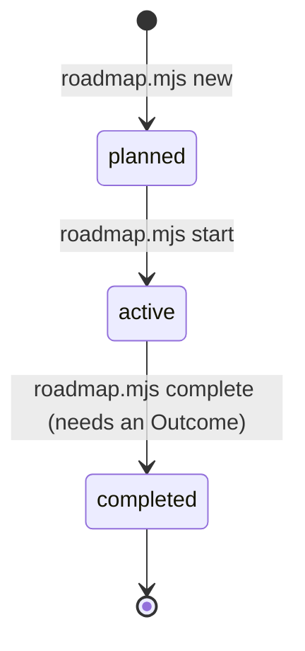

# The roadmap

This folder is the only place plans live. It separates four things that used to share one
file and rot together: **what we are trying to do** (`goals.md`), **where we are**
(`progress.md`), **what we are doing right now** (`active/`), and **what we did and learned**
(`completed/`). Candidates that are not yet started wait in `planned/`.

## Layout

```text
docs/roadmap/
├── README.md        this file — how the roadmap works
├── goals.md         purpose, milestones, current direction, how a candidate becomes a slice
├── progress.md      the status board, generated between markers by scripts/roadmap.mjs
├── active/          the plan(s) being executed — normally exactly one
├── planned/         candidate slices: short definitions, no implementation detail
└── completed/       frozen records: outcome, slice definition, the plan as executed
```

## A plan's life



Every plan is one Markdown file whose **first line** is a state marker the scripts own:

```text
<!-- plan id="18" status="planned" summary="Month and agenda views derived from existing dates" -->
<!-- plan id="18" status="active"  summary="…" -->
<!-- completed-record id="18" closed="2026-09-20" summary="…" -->
```

The `summary` is one line, written for the reader who will never open the file. It is what
the board shows.

### planned/

A candidate. Goal, spec sections, a sketch of the build, the done-when and the do-not — the
five short sections of [the template](../templates/implementation-plan.md). Nothing more:
detail written before a slice starts is detail that will be wrong. Candidates are ordered by
`goals.md`, not by their number.

### active/

The one document edited during a phase. When a plan starts, the rest of the template is
filled in per [AGENTS.md](../../AGENTS.md) step 1 — acceptance check, file-level change
list, test plan, boundaries, non-goals, open questions — and reviewed to closure (step 2),
with every review round recorded under **Revisions**. At the end of the phase the
**Outcome** is written (step 5). Two active plans at once means the phase was scoped wrong.

### completed/

Frozen. A record is evidence of what was done and thought at the time; the current state of
the systems it touched lives in [`docs/architecture/`](../architecture/overview.md). If a
record is now misleading, add a dated note directly under its banner — do not edit the
record into agreement. Records are listed on the board by closing date.

The thirty-one records that predate this folder were assembled on 2026-09-10 from the old
`development.md` build order and `docs/plans/`: each carries the slice's outcome narrative
as the build order recorded it, the slice definition, and the implementation plan with its
headings demoted one level. Their banners say so.

## Commands

```bash
node scripts/roadmap.mjs new <id> <slug> --title "…" --summary "…"   # → planned/<id>-<slug>.md
node scripts/roadmap.mjs start docs/roadmap/planned/<file>            # planned → active
node scripts/roadmap.mjs complete docs/roadmap/active/<file> [--closed YYYY-MM-DD] [--summary "…"]
node scripts/roadmap.mjs sync                                         # regenerate the board
node scripts/roadmap.mjs check                                        # what pnpm docs:check runs
```

`start` and `complete` use `git mv`, so a plan's history follows it. `complete` refuses a
plan without written prose under `## Outcome`; the template placeholders do not count.
`pnpm docs:check` fails when a marker is malformed, a file
sits in the wrong folder, an id is reused, or the board is stale.

## What goes where — quick answers

| I want to… | Do this |
|---|---|
| Record a new idea for later | `roadmap.mjs new` — five short sections, then stop. |
| Change the order candidates should be built in | Edit `goals.md`. The board does not encode priority. |
| Note that a done slice's behaviour has since changed | Nothing in the record. Update `docs/architecture/`; if the record now misleads, a dated note under its banner. |
| Track progress inside a phase | The active plan's **Revisions** and, at the end, **Outcome**. Not `progress.md`. |
| Answer a product question | A `docs/decisions/` entry, linked from the active plan and from the system's `why.md`. |
| Close a milestone | `goals.md`: move it from *Now* to *Done*, say what the evidence was, name what comes next. |
