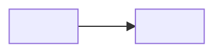
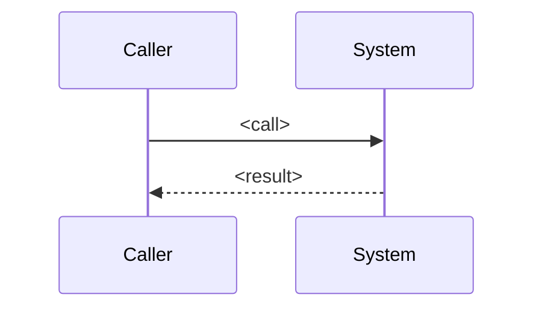

# What <system name> is made of

<!-- Diagrams first, inventory second. Every node in a diagram exists under the name shown.
     Top two levels of the tree use Mermaid C4 (C4Context / C4Container / C4Component);
     deeper levels use flowchart or sequenceDiagram. Split rather than crowd. -->

## Structure

<One paragraph reading the diagram: what the boxes are, what the arrows mean.>

## A request through it

<!-- Optional. A sequence diagram of the one flow that explains the system best. -->

## Inventory

| Part | Path | Role |
|---|---|---|
| `<Symbol or file>` | `<path>` | <one line> |
